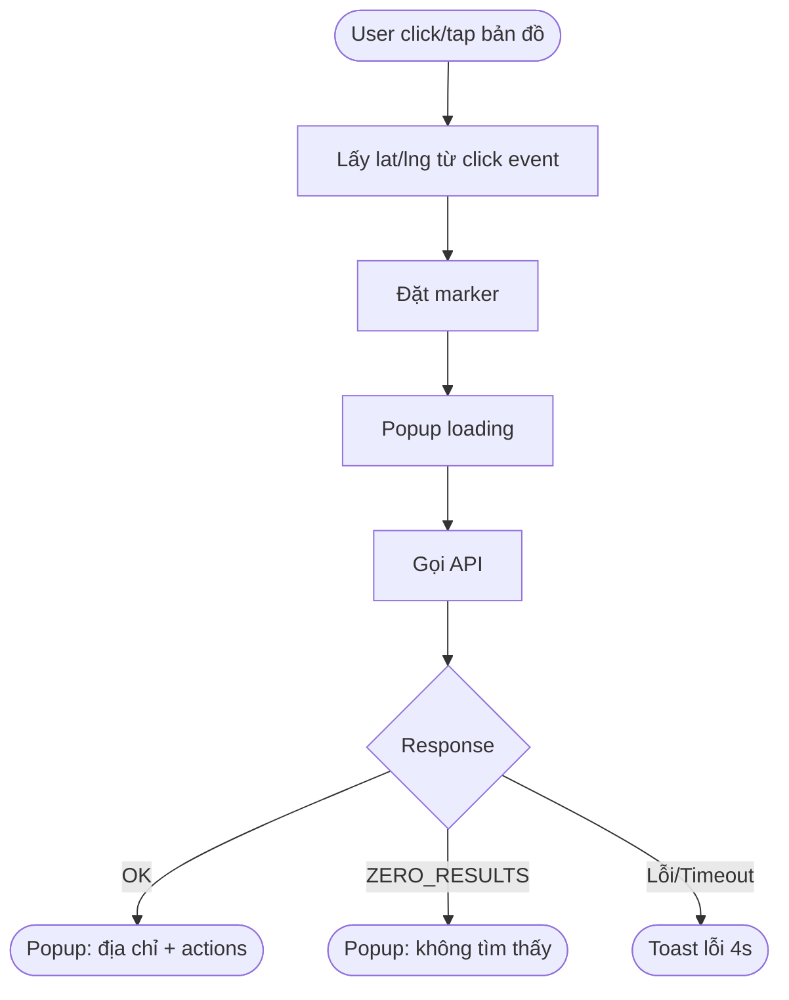
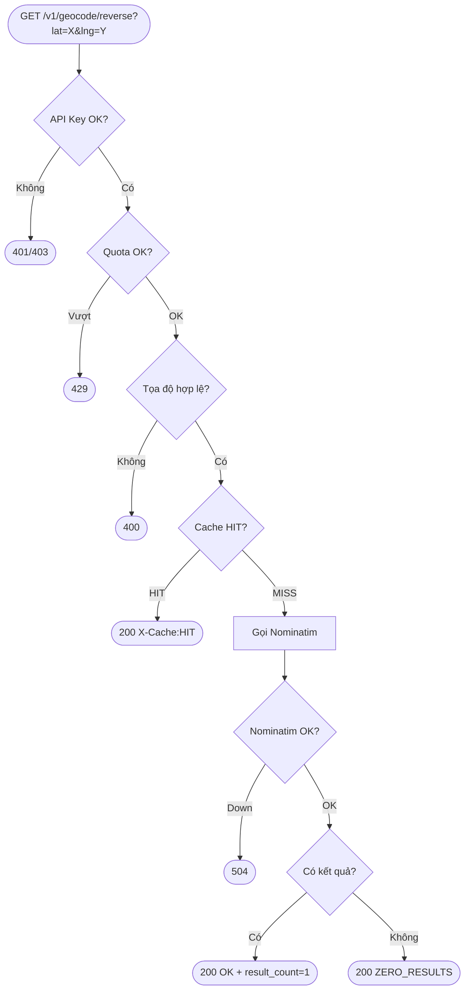

# [FEAT-RG-001] Reverse Geocoding

> **Module:** `maps-api` · `maps-viewer`  
> **Epic:** Geocoding Services  
> **Priority:** `P0`  
> **Status:** `Ready for Build`  
> **Version:** 1.6
> **Last updated:** 2026-03-09 · Claude (supplemented from v1.5)
> **COMMON version inherited:** `1.3`  
> **Override sections:** `§VIII`, `§IX`, `§X`, `§XI`, `§XII`, `§XIV`, `§XV`, `§XVII`, `§XVIII`, `§XIX`  
> **Owner:** Geocoding Team / Platform Team  
> **Kế thừa từ:** [COMMON_v1.3_supplemented.md](./COMMON_v1.3_supplemented.md) — Auth, Rate Limiting, NFR, Response Contract, Caching, Logging, Monitoring, Security, DoD

---

## Mục lục

| # | Section | Người tham gia |
|---|---|---|
| I | [Overview](#i-overview) | PO · BA |
| II | [Out of Scope & Non-goals](#ii-out-of-scope--non-goals) | PO · BA · Architect |
| III | [Decision Summary for V1](#iii-decision-summary-for-v1) | PO · BA · Architect |
| IV | [Glossary](#iv-glossary) | BA · DES · QC |
| V | [User Stories](#v-user-stories) | PO · BA |
| VI | [Traceability Matrix](#vi-traceability-matrix) | BA · QA · QC |
| VII | [Triggers & Entry Points](#vii-triggers--entry-points) | BA · DES · Frontend Dev |
| VIII | [Non-Functional Requirements](#viii-non-functional-requirements) | PO · BA · DevOps · QA |
| IX | [Business Rules](#ix-business-rules) | PO · BA |
| X | [API Contract](#x-api-contract) | Backend Dev · QA |
| XI | [UI/UX Specification](#xi-uiux-specification) | DES · Frontend Dev |
| XII | [Accessibility & UX Content Rules](#xii-accessibility--ux-content-rules) | DES · Frontend Dev · QA |
| XIII | [Acceptance Criteria](#xiii-acceptance-criteria) | BA · QA · QC |
| XIV | [Product Analytics Events](#xiv-product-analytics-events) | PO · BA · Frontend Dev · Data |
| XV | [Technical Notes](#xv-technical-notes) | Backend Dev · DevOps |
| XVI | [Definition of Done](#xvi-definition-of-done) | PO · QC |
| XVII | [Release / Rollout / Rollback Plan](#xvii-release--rollout--rollback-plan) | PO · DevOps · Leads |
| XVIII | [Risks & Assumptions](#xviii-risks--assumptions) | BA · PO · DevOps |
| XIX | [Monitoring & Alerting](#xix-monitoring--alerting) | DevOps · QA |
| XX | [Testing Requirements](#xx-testing-requirements) | QA · QC · DevOps |
| XXI | [Sign-off Matrix](#xxi-sign-off-matrix) | PO · QC |
| XXII | [Open Items còn lại](#xxii-open-items-còn-lại) | All |
| XXIII | [Document References](#xxiii-document-references) | All |
| XXIV | [Changelog](#xxiv-changelog) | All |
| — | [Appendix A: Flow Diagrams](#appendix-a-flow-diagrams) | BA · DES · Dev |
| — | [Appendix B: Test Data Spec](#appendix-b-test-data-spec) | QA · GIS |

---

## I. Overview
`👤 PO · BA`

### What

Reverse Geocoding chuyển đổi tọa độ địa lý `(lat, lng)` thành địa chỉ hoặc mô tả vị trí tương ứng, trả về kết quả có cấu trúc theo hệ thống hành chính Việt Nam.

### Why

- **User need:** Người dùng cần xác định địa chỉ thực tế từ một vị trí trên bản đồ mà không phải tự đọc tọa độ thô.
- **Business value:** Là API nền tảng dùng bởi Maps Viewer, Fleet Management, Logistics và khách hàng enterprise; dự kiến có call volume lớn.
- **Data sovereignty:** Dữ liệu địa chỉ được lưu trữ và xử lý trên hạ tầng GTEL.

### In Scope

| Hạng mục | Mô tả |
|---|---|
| Reverse Geocoding API | Chuyển đổi `(lat, lng)` → địa chỉ chuẩn hóa |
| VN administrative address | Trả kết quả theo hệ thống hành chính Việt Nam |
| `language=vi|en` | Hỗ trợ song ngữ theo chuẩn platform |
| `result_type` | Lọc kết quả theo cấp hành chính |
| UI triggers + API entry | Hỗ trợ cả Maps Viewer và API consumer |
| Usage tracking | Ghi nhận usage, quota, rate limiting |
| Cache | Caching cho tọa độ trùng lặp |


---

## II. Out of Scope & Non-goals
`👤 PO · BA · Architect`

> Mục này dùng để **chặn scope creep** và làm rõ những gì team **không cam kết** trong V1.

| Hạng mục | Trạng thái V1 | Ghi chú |
|---|---|---|
| Forward geocoding | ❌ Out of scope | Đặc tả riêng ở feature khác |
| Geocoding ngoài lãnh thổ Việt Nam | ❌ Out of scope | V1 trả `ZERO_RESULTS` |
| Batch reverse geocoding | ❌ Out of scope | Tách thành feature riêng |
| POI enrichment / place category | ❌ Out of scope | Không cam kết ở API này |
| Webhook / async callback | ❌ Out of scope | Chỉ synchronous HTTP |
| SDK wrapper | ❌ Out of scope | Tài liệu API độc lập với SDK |
| Secondary geocoder fallback | ❌ Out of scope | V1 không dùng fallback |
| Multi-result response | ❌ Out of scope | `results.length` tối đa 1 |
| DMS parser trong Search Bar | ❌ Out of scope | Chỉ decimal degrees |
| Billing / invoicing UI | ❌ Out of scope | Chỉ log usage cho pipeline |


---

## III. Decision Summary for V1
`👤 PO · BA · Architect`

> Mục tiêu của section này là **đóng các điểm mơ hồ để dev/QA có thể build ngay**.

| Chủ đề | Quyết định V1 | Tác động |
|---|---|---|
| Result cardinality | **Single result only**; `results[]` có độ dài `0..1` | Giảm mơ hồ cho UI, SDK, QA |
| Tọa độ ngoài VN | Trả `200 ZERO_RESULTS` | Nhất quán với COMMON |
| Cache precision | **3 chữ số thập phân** cho reverse geocoding viewer/API chuẩn | Tối ưu cache hit ratio |
| Search Bar format | Chỉ hỗ trợ **decimal degrees** trong V1 | Tránh phát sinh parser phức tạp |
| Deep link default zoom | `15` | Đủ tốt cho viewer mặc định |
| Upstream fallback | **Không có secondary geocoder** trong V1; upstream down → `504` | Giữ kiến trúc đơn giản cho phát hành đầu |
| Quota | Áp dụng platform defaults từ COMMON | Không chờ quyết định thương mại riêng |
| Log privacy | Log tọa độ ở **3dp** | Nhất quán pipeline analytics |

---

## IV. Glossary
`👤 BA · DES · QC`

> Thuật ngữ chung → xem **[COMMON_v1.3_supplemented.md §1](./COMMON_v1.3_supplemented.md#1-glossary-chung)**.

| Thuật ngữ | Định nghĩa |
|---|---|
| **Reverse Geocoding** | Quá trình chuyển đổi tọa độ `(lat, lng)` thành địa chỉ hoặc mô tả vị trí |
| **`formatted_address`** | Chuỗi địa chỉ đầy đủ, chuẩn hóa, dạng đọc được |
| **`address_components`** | Mảng các thành phần địa chỉ, mỗi phần tử gồm `long_name`, `short_name`, `types[]` |
| **`result_type`** | Tham số lọc cấp hành chính: `street_address`, `ward`, `district`, `province`, `country` |
| **`location_type`** | `ROOFTOP` / `RANGE_INTERPOLATED` / `GEOMETRIC_CENTER` / `APPROXIMATE` |
| **Popup** | Hộp thông tin nổi trên bản đồ |
| **Bottom Sheet** | Panel trượt từ dưới lên trên mobile portrait |
| **Marker** | Ghim vị trí hiển thị trên bản đồ |

---

## V. User Stories
`👤 PO · BA`

| ID | Role | Goal | Reason |
|---|---|---|---|
| US-01 | Developer | Gửi một cặp tọa độ và nhận lại địa chỉ có cấu trúc | Hiển thị địa chỉ cho end-user |
| US-02 | Developer | Lọc kết quả theo cấp hành chính | Chỉ lấy đúng cấp thông tin cần thiết |
| US-03 | Developer | Nhận địa chỉ bằng tiếng Anh hoặc tiếng Việt | Phục vụ ứng dụng đa ngôn ngữ |
| US-04 | End User | Click vào bản đồ và thấy địa chỉ ngay | Hiểu vị trí đang chọn |
| US-05 | End User (Mobile) | Long press để xem địa chỉ | Thao tác tự nhiên trên cảm ứng |
| US-06 | End User | Mở link có tọa độ và thấy địa chỉ tự động | Chia sẻ vị trí qua URL |
| US-07 | Platform Admin | Xem usage per API key | Quản lý quota và phát hiện bất thường |

---

## VI. Traceability Matrix
`👤 BA · QA · QC`

> Mục tiêu: nối **User Story → Business Rule → AC → Test/UAT** để refinement, QA và sign-off không bị rời rạc.

| User Story | Business Rules | Acceptance Criteria | Test / UAT coverage |
|---|---|---|---|
| US-01 Developer reverse geocode | BR-RG-01, BR-RG-02, BR-RG-03 | A01, A02, A03, A06, A08, A09 | API UAT 1, 4, 7 |
| US-02 Lọc theo cấp hành chính | BR-RG-01 | A04 | API UAT mở rộng với `result_type` |
| US-03 Song ngữ `vi/en` | BR-CMN-04 | A05 | API UAT 6 |
| US-04 Click để xem địa chỉ | BR-RG-02, BR-RG-04 | B01, B02, B03, B04, B05, B06, B07 | Web UAT 1 |
| US-05 Long press mobile | BR-RG-02, BR-RG-04 | B02, B03, B04, B05, B06, B07, B09 | Mobile UAT 1, 2 |
| US-06 Deep link tự mở địa chỉ | BR-RG-05, BR-RG-06 | B02, B03, B04, B05, B06, B07, B12 | Web UAT 6, 7 |
| US-07 Admin xem usage / bất thường | BR-CMN-02, BR-CMN-05 | CMN-LOG, CMN-RATELIMIT | Dashboard + alert + analytics event review |

### Checklist traceability

- [ ] Mọi user story đều map ít nhất 1 BR và 1 AC
- [ ] Mọi AC P0 đều có test case hoặc UAT step tương ứng
- [ ] Không có business rule nào “mồ côi” không được kiểm chứng


---

## VII. Triggers & Entry Points
`👤 BA · DES · Frontend Dev`

### Bảng tổng hợp trigger

| ID | Trigger | Nền tảng | Input | AC riêng |
|---|---|---|---|---|
| T01 | Click / tap trên bản đồ | Web, Mobile | `(lat, lng)` từ map click event | AC-B01 |
| T02 | Right-click → Context Menu → "Đây là đâu?" | Web | `(lat, lng)` từ right-click event | AC-B08 |
| T03 | Long press trên bản đồ | Mobile | `(lat, lng)` từ long press event | AC-B09 |
| T04 | Drag & drop marker đến vị trí mới | Web, Mobile | `(lat, lng)` từ dragend event | AC-B10 |
| T05 | Nhập tọa độ thủ công vào Search Bar | Web, Mobile | String `"lat, lng"` | AC-B11 |
| T06 | Paste tọa độ / Deep link URL | Web, Mobile | URL query params | AC-B12 |
| T07 | Dùng vị trí GPS hiện tại | Mobile, Web | `(lat, lng)` từ Geolocation API | AC-B13 |
| T08 | Nhận tọa độ từ API bên ngoài | API | HTTP request params | AC-A01 đến A10 + CMN-* |

> T01–T07 đều kết thúc bằng cùng một API call → toàn bộ AC nhóm A và AC-B02–B07 áp dụng cho tất cả.

### Ma trận AC × Trigger

| AC | T01 | T02 | T03 | T04 | T05 | T06 | T07 | T08 |
|---|:---:|:---:|:---:|:---:|:---:|:---:|:---:|:---:|
| **A01** Happy Path | ✅ | ✅ | ✅ | ✅ | ✅ | ✅ | ✅ | ✅ |
| **A02** address_components | ✅ | ✅ | ✅ | ✅ | ✅ | ✅ | ✅ | ✅ |
| **A03** Kết quả gần đúng | ✅ | ✅ | ✅ | ✅ | ✅ | ✅ | ✅ | ✅ |
| **A04** result_type | — | — | — | — | — | — | — | ✅ |
| **A05** language | — | — | — | — | — | — | — | ✅ |
| **A06** ZERO_RESULTS | ✅ | ✅ | ✅ | ✅ | ✅ | ✅ | ✅ | ✅ |
| **A07** Validation | — | — | — | — | ✅ | ✅ | — | ✅ |
| **A08** Single-result contract | ✅ | ✅ | ✅ | ✅ | ✅ | ✅ | ✅ | ✅ |
| **A09** Response shape consistency | ✅ | ✅ | ✅ | ✅ | ✅ | ✅ | ✅ | ✅ |
| **A10** Upstream timeout/failure | ✅ | ✅ | ✅ | ✅ | ✅ | ✅ | ✅ | ✅ |
| **CMN-AUTH** | — | — | — | — | — | — | — | ✅ |
| **CMN-RATELIMIT** | — | — | — | — | — | — | — | ✅ |
| **CMN-RESPONSE** | ✅ | ✅ | ✅ | ✅ | ✅ | ✅ | ✅ | ✅ |
| **CMN-CACHE** | ✅ | ✅ | ✅ | ✅ | ✅ | ✅ | ✅ | ✅ |
| **CMN-LOG** | ✅ | ✅ | ✅ | ✅ | ✅ | ✅ | ✅ | ✅ |
| **B01** Click trigger | ✅ | — | — | — | — | — | — | — |
| **B02** Marker | ✅ | ✅ | ✅ | — | ✅ | ✅ | ✅ | — |
| **B03** Loading | ✅ | ✅ | ✅ | ✅ | ✅ | ✅ | ✅ | — |
| **B04** Success UI | ✅ | ✅ | ✅ | ✅ | ✅ | ✅ | ✅ | — |
| **B05** ZERO_RESULTS UI | ✅ | ✅ | ✅ | ✅ | ✅ | ✅ | ✅ | — |
| **B06** Error UI | ✅ | ✅ | ✅ | ✅ | ✅ | ✅ | ✅ | — |
| **B07** Perf render | ✅ | ✅ | ✅ | ✅ | ✅ | ✅ | ✅ | — |
| **B08** Context Menu | — | ✅ | — | — | — | — | — | — |
| **B09** Long Press | — | — | ✅ | — | — | — | — | — |
| **B10** Drag & Drop | — | — | — | ✅ | — | — | — | — |
| **B11** Search Bar | — | — | — | — | ✅ | — | — | — |
| **B12** Deep Link | — | — | — | — | — | ✅ | — | — |
| **B13** GPS | — | — | — | — | — | — | ✅ | — |

---

## VIII. Non-Functional Requirements
`👤 PO · BA · DevOps · QA`

> NFR chung → **[COMMON_v1.3_supplemented.md §5](./COMMON_v1.3_supplemented.md#5-non-functional-requirements)**.

### Override — Performance

| Chỉ số | Giá trị COMMON | Override RG | Rule |
|---|---|---|---|
| P95 Latency (cache MISS) | ≤ 500ms | **≤ 300ms** | Chỉ có hiệu lực khi perf test staging pass |
| Throughput | ≥ 100 RPS | **≥ 500 RPS** | Đo bằng k6 với mix cache HIT/MISS rõ ràng |

### Bổ sung — UI Performance

| Chỉ số | Yêu cầu |
|---|---|
| Marker xuất hiện sau trigger | ≤ 100ms |
| Popup / bottom sheet render sau response | ≤ 500ms |
| Không có CLS đáng kể | Khi địa chỉ load vào popup |

---

## IX. Business Rules
`👤 PO · BA`

> BR chung → **[COMMON_v1.3_supplemented.md §4](./COMMON_v1.3_supplemented.md#4-business-rules--quota--coverage)**.

### BR-RG-01 — Ưu tiên kết quả trả về

Khi có nhiều kết quả khả dụng, ưu tiên theo thứ tự độ chính xác giảm dần:

```text
ROOFTOP > RANGE_INTERPOLATED > GEOMETRIC_CENTER > APPROXIMATE
```

### BR-RG-02 — Cardinality

- V1 chỉ trả về **0 hoặc 1 result**.
- `results[]` tồn tại để giữ tương thích format platform, nhưng `maxItems = 1` trong V1.
- Nếu tương lai hỗ trợ multi-result thì phải tăng minor/major version của feature contract.

### BR-RG-03 — Tọa độ ngoài Việt Nam

- Trả về `200 ZERO_RESULTS`.
- Không phân biệt ngoài VN với trong VN nhưng không có dữ liệu trong V1.

### BR-RG-04 — Cache precision

- Cache key dùng tọa độ làm tròn **3 chữ số thập phân** (~111m).
- Mục tiêu: tối ưu cache hit ratio cho Maps Viewer / click-based workloads.
- Use case fleet tracking cần độ chính xác cao hơn phải dùng profile hoặc feature khác, không đổi chuẩn V1 này.

### BR-RG-05 — Search Bar format

- V1 chỉ hỗ trợ **decimal degrees**: `lat,lng`.
- Không hỗ trợ DMS trong V1.
- Input sai format → FE xử lý inline error, không gọi API.

### BR-RG-06 — Deep link behavior

- Deep link mặc định `zoom=15` nếu URL không truyền zoom.
- Params hợp lệ → auto place marker + gọi API.
- Params sai → bản đồ về default view + toast lỗi + không gọi API.

### BR-RG-07 — Upstream failure policy

- V1 không có secondary geocoder fallback.
- Nominatim timeout / down → `504 GATEWAY_TIMEOUT` theo COMMON.
- DevOps phải có alert và runbook tương ứng.

### BR-RG-08 — GPS accuracy threshold

- Nếu GPS accuracy > **100m**: UI hiển thị badge "Vị trí ước tính" trên marker.
- Ngưỡng 100m là quyết định UX cho V1; thay đổi ngưỡng cần sign-off DES + BA.
- Nếu thiết bị không hỗ trợ GPS hoặc Geolocation API không khả dụng → nút "Vị trí của tôi" ở trạng thái `disabled` + tooltip giải thích.

---

## X. API Contract
`👤 Backend Dev · QA`

### Request

```http
GET /v1/geocode/reverse
Authorization: Bearer {api_key}
Accept: application/json
```

| Parameter | Type | Required | Default | Description |
|---|---|---|---|---|
| `lat` | `float` | ✅ | — | Vĩ độ `[-90, 90]` |
| `lng` | `float` | ✅ | — | Kinh độ `[-180, 180]` |
| `result_type` | `string` | ❌ | all | `street_address`, `ward`, `district`, `province`, `country` |
| `language` | `string` | ❌ | `vi` | `vi`, `en` |

**Permission scope required:** `geocoding.reverse`

### Response — Thành công `200 OK`

```json
{
  "status": "OK",
  "request_id": "3f6a1b2c-84d7-4e9a-bc01-2f3d4e5f6a7b",
  "results": [
    {
      "formatted_address": "136 Nguyễn Huệ, Phường Bến Nghé, Quận 1, Hồ Chí Minh, Việt Nam",
      "place_id": "gtel_place_abc123xyz",
      "address_components": [
        { "long_name": "136", "short_name": "136", "types": ["street_number"] },
        { "long_name": "Nguyễn Huệ", "short_name": "Nguyễn Huệ", "types": ["route"] },
        { "long_name": "Phường Bến Nghé", "short_name": "Bến Nghé", "types": ["sublocality_level_1"] },
        { "long_name": "Quận 1", "short_name": "Q.1", "types": ["administrative_area_level_2"] },
        { "long_name": "Hồ Chí Minh", "short_name": "TP.HCM", "types": ["administrative_area_level_1"] },
        { "long_name": "Việt Nam", "short_name": "VN", "types": ["country"] }
      ],
      "geometry": {
        "location": { "lat": 10.7769, "lng": 106.7009 },
        "location_type": "ROOFTOP"
      },
      "types": ["street_address"]
    }
  ]
}
```

### Response shape rules

- `results.length` trong V1: `0..1`
- `results=[]` chỉ dùng cho `ZERO_RESULTS`
- Error JSON shape kế thừa từ COMMON

### Error Codes

> Kế thừa đầy đủ từ **[COMMON §6](./COMMON_v1.3_supplemented.md#6-response-contract--error-codes)**. Bảng dưới liệt kê các code **áp dụng trực tiếp** cho endpoint này để dev/QA không cần tra cứu chéo.

| HTTP | `status` | Mô tả | Nguồn |
|---|---|---|---|
| `400` | `MISSING_PARAMETER` | Thiếu `lat` hoặc `lng` | COMMON |
| `400` | `INVALID_REQUEST` | `lat`/`lng` sai kiểu hoặc ngoài range | COMMON |
| `400` | `INVALID_LANGUAGE` | `language` không phải `vi` hoặc `en` | COMMON |
| `400` | `INVALID_RESULT_TYPE` | `result_type` không hợp lệ | Feature-specific |
| `401` | `MISSING_API_KEY` | Không có API key | COMMON |
| `401` | `INVALID_API_KEY` | API key sai hoặc hết hạn | COMMON |
| `403` | `PERMISSION_DENIED` | Key không có scope `geocoding.reverse` | COMMON |
| `403` | `API_KEY_DISABLED` | Key bị vô hiệu hóa | COMMON |
| `429` | `OVER_QUERY_LIMIT` | Vượt QPS | COMMON |
| `429` | `QUOTA_EXCEEDED` | Hết quota ngày/tháng | COMMON |
| `500` | `INTERNAL_ERROR` | Lỗi hệ thống | COMMON |
| `504` | `GATEWAY_TIMEOUT` | Nominatim timeout / down | COMMON |

---

## XI. UI/UX Specification
`👤 DES · Frontend Dev`

### States Inventory

| State | Mô tả | Component |
|---|---|---|
| `idle` | Chưa có tương tác | Không có popup / marker |
| `loading` | Chờ API response | Popup / Bottom sheet + spinner |
| `success` | Có địa chỉ | Popup / Bottom sheet + actions |
| `zero_results` | Không tìm thấy | Empty message |
| `error` | API lỗi / timeout | Toast |
| `gps_denied` | Từ chối quyền vị trí | Toast |
| `gps_low_accuracy` | GPS accuracy > 100m | Marker + badge |
| `dragging` | Đang kéo marker | Popup đóng |
| `disabled` | GPS không khả dụng | Nút disabled + tooltip |

### Component Inventory

| Component | Dùng trong | Trạng thái |
|---|---|---|
| Map Marker | T01–T07 | Existing / DS |
| Popup card | Web / tablet | Existing / DS |
| Bottom Sheet | Mobile portrait | Existing hoặc New |
| Toast notification | Error states | Existing / DS |
| Loading spinner | Loading state | Existing / DS |
| Context Menu item | T02 | Existing / DS |
| GPS accuracy badge | T07 low accuracy | New |
| Search Bar coord input | T05 | Existing / DS |
| Inline error text | T05, T06 | Existing / DS |

### Responsive Behavior

| Breakpoint | Popup style | Action buttons |
|---|---|---|
| Mobile portrait (< 768px) | Bottom Sheet | Stack dọc |
| Mobile landscape (< 768px) | Popup nhỏ cạnh marker | Inline ngang |
| Tablet (768px–1024px) | Popup tiêu chuẩn | Inline ngang |
| Desktop (> 1024px) | Popup tiêu chuẩn | Inline ngang |

### Typography

- Font: **Be Vietnam Pro**
- `formatted_address`: 14px / 500
- Secondary text: 12px / regular

---

## XII. Accessibility & UX Content Rules
`👤 DES · Frontend Dev · QA`

### Accessibility baseline

| Hạng mục | Rule |
|---|---|
| Keyboard | Tất cả action trong popup / context menu / sheet phải tab được |
| Focus state | Có focus ring rõ ràng cho action buttons và context menu item |
| Screen reader | Nút / icon phải có `aria-label` rõ nghĩa |
| Loading state | Spinner phải có text đi kèm: `Đang tìm địa chỉ...` |
| Toast | Không chỉ dựa vào màu; phải có text mô tả lỗi |
| Touch target | Button / menu item tối thiểu ~44px trên mobile |
| Contrast | Text chính và action button đạt contrast phù hợp design system |

### UX content rules

| Tình huống | Copy rule |
|---|---|
| Thành công | Ưu tiên hiển thị `formatted_address`, tránh jargon kỹ thuật |
| ZERO_RESULTS | Dùng câu rõ nghĩa: `Không tìm thấy địa chỉ cho vị trí này` |
| Lỗi hệ thống | Không lộ nguyên nhân nội bộ; dùng copy trung tính, có gợi ý thử lại |
| GPS denied | Ghi rõ người dùng cần cấp quyền vị trí |
| Inline validation | Chỉ ra lỗi format / range, không dùng message mơ hồ |

### i18n rules

- UI copy mặc định theo locale app.
- `formatted_address` theo tham số `language` của request.
- Nút / toast / helper text phải có key i18n, không hard-code trực tiếp trong component.

### QA accessibility checks

- [ ] Tab order hợp lý trên desktop
- [ ] Screen reader đọc được tên nút chính
- [ ] Không bị mất focus sau khi popup đóng / mở
- [ ] Toast vẫn hiểu được khi không nhìn màu


---

## XIII. Acceptance Criteria
`👤 BA · QA · QC`

### Nhóm A — API Behavior (Backend)
`Implement: Backend Dev | Review: QA | Sign-off: QC`

> **Kế thừa từ COMMON:** Auth, Rate Limiting, Response Contract, Caching, Logging.

#### AC-A01 · Happy Path — Tọa độ hợp lệ trong lãnh thổ VN

```gherkin
Given  API key hợp lệ, có quyền "geocoding.reverse"
And    lat = 10.7769, lng = 106.7009
When   GET /v1/geocode/reverse?lat=10.7769&lng=106.7009
Then   HTTP 200, "status": "OK"
And    "results" chứa 1 phần tử
And    "formatted_address" là chuỗi không rỗng
And    "geometry.location" chứa lat/lng tương ứng
```

#### AC-A02 · `address_components` chuẩn hóa

```gherkin
Given  tọa độ trả về kết quả có địa chỉ đầy đủ
When   đọc mảng "address_components"
Then   mỗi phần tử có đủ: "long_name", "short_name", "types[]"
```

| `types` value | Ý nghĩa | Bắt buộc |
|---|---|---|
| `street_number` | Số nhà | ❌ Nếu có dữ liệu |
| `route` | Tên đường | ❌ Nếu có dữ liệu |
| `sublocality_level_1` | Phường / Xã | ✅ |
| `administrative_area_level_2` | Quận / Huyện | ✅ |
| `administrative_area_level_1` | Tỉnh / Thành phố | ✅ |
| `country` | Quốc gia (`VN`) | ✅ |
| `postal_code` | Mã bưu chính | ❌ Nếu có dữ liệu |

#### AC-A03 · Kết quả gần đúng khi không có địa chỉ chính xác

```gherkin
Given  tọa độ hợp lệ nhưng không khớp chính xác với địa chỉ
When   GET /v1/geocode/reverse?lat={lat}&lng={lng}
Then   HTTP 200, "status": "OK"
And    "results" chứa 1 phần tử cấp hành chính gần nhất
And    "geometry.location_type" ∈ { "RANGE_INTERPOLATED", "GEOMETRIC_CENTER", "APPROXIMATE" }
```

#### AC-A04 · `result_type`

```gherkin
Given  request có result_type=district, tọa độ thuộc Quận 1
When   GET /v1/geocode/reverse?...&result_type=district
Then   "results[0].types" chứa cấp tương ứng district

Given  result_type có giá trị không hợp lệ
Then   HTTP 400, "status": "INVALID_RESULT_TYPE"
```

#### AC-A05 · `language`

```gherkin
Given  language=en
Then   "formatted_address" bằng tiếng Anh hoặc Latin chuẩn hóa

Given  không có tham số language
Then   mặc định language=vi

Given  language=jp
Then   HTTP 400, "status": "INVALID_LANGUAGE"
```

#### AC-A06 · ZERO_RESULTS

```gherkin
Given  tọa độ ngoài lãnh thổ VN
   OR  tọa độ trong VN nhưng vùng không có dữ liệu
When   gọi API
Then   HTTP 200, "status": "ZERO_RESULTS", "results": []
```

#### AC-A07 · Validation tham số đầu vào

| Trường hợp | Input | HTTP | `status` |
|---|---|---|---|
| Thiếu `lat` | `?lng=106.7` | 400 | `MISSING_PARAMETER` |
| Thiếu `lng` | `?lat=10.77` | 400 | `MISSING_PARAMETER` |
| `lat` > 90 | `lat=91` | 400 | `INVALID_REQUEST` |
| `lat` < -90 | `lat=-91` | 400 | `INVALID_REQUEST` |
| `lng` > 180 | `lng=181` | 400 | `INVALID_REQUEST` |
| `lng` < -180 | `lng=-181` | 400 | `INVALID_REQUEST` |
| Sai kiểu | `lat=abc` | 400 | `INVALID_REQUEST` |
| `result_type` sai | `result_type=xyz` | 400 | `INVALID_RESULT_TYPE` |
| `language` sai | `language=jp` | 400 | `INVALID_LANGUAGE` |
| Null island | `lat=0&lng=0` | 200 | `ZERO_RESULTS` |

#### AC-A08 · Single-result contract

```gherkin
Given  bất kỳ request hợp lệ nào của V1
When   API trả về thành công
Then   "results" có độ dài tối đa là 1
And    nếu có kết quả thì phần tử tốt nhất đứng ở index 0
```

#### AC-A09 · Response shape consistency

```gherkin
Given  hai request giống nhau về lat, lng, result_type, language trong cùng dữ liệu nguồn
When   API trả về kết quả
Then   JSON shape nhất quán
And    các field bắt buộc không thay đổi tên
```

#### AC-A10 · Upstream timeout / failure

```gherkin
Given  Nominatim timeout hoặc không khả dụng
When   gọi reverse geocoding
Then   HTTP 504, "status": "GATEWAY_TIMEOUT"
And    không trả partial result giả định
```

### Nhóm B — UI Behavior (Maps Viewer Frontend)
`Implement: Frontend Dev | Design: DES | Review: QA | Sign-off: QC`

#### AC-B01 · Click / tap (T01)

```gherkin
Given  người dùng đang xem bản đồ
When   click / tap vào vị trí bất kỳ
Then   hệ thống lấy lat/lng và gọi Reverse Geocoding API tự động
```

#### AC-B02 · Marker

```gherkin
Given  bất kỳ trigger nào kích hoạt (trừ T04)
When   hệ thống nhận tọa độ
Then   marker xuất hiện trong 100ms
And    chỉ 1 marker tồn tại
```

#### AC-B03 · Loading state

```gherkin
Given  API call đang thực hiện
When   chờ > 150ms
Then   loading indicator hiển thị tại popup / bottom sheet
And    text: "Đang tìm địa chỉ..."
```

> **Lý do 150ms:** NFR yêu cầu P95 ≤ 300ms (cache MISS). Với threshold 300ms, đa số request sẽ resolve trước khi loading hiển thị, gây flash UI. 150ms đảm bảo loading xuất hiện đủ sớm cho perceived performance.

#### AC-B04 · Success state

```gherkin
Given  API trả về "status": "OK"
Then   popup / bottom sheet hiển thị "formatted_address"
And    có nút "Sao chép địa chỉ" và "Chỉ đường đến đây"
```

#### AC-B05 · ZERO_RESULTS state

```gherkin
Given  API trả về "status": "ZERO_RESULTS"
Then   hiển thị "Không tìm thấy địa chỉ cho vị trí này"
And    marker vẫn còn trên bản đồ
```

#### AC-B06 · Error state

```gherkin
Given  API lỗi 4xx/5xx hoặc timeout sau 5 giây (theo COMMON §5)
Then   toast "Không thể tải địa chỉ, vui lòng thử lại"
And    toast tự đóng sau 4 giây
```

#### AC-B07 · UI performance

```gherkin
Given  bất kỳ trigger T01–T07 được kích hoạt
Then   marker xuất hiện trong ≤ 100ms sau trigger

Given  API trả về response thành công
Then   popup / bottom sheet render hoàn tất trong ≤ 500ms sau response

Given  popup đang hiển thị loading và nhận được địa chỉ
When   nội dung địa chỉ được render vào popup
Then   không có Cumulative Layout Shift đáng kể (CLS < 0.1)
```

#### AC-B08 · Context Menu (T02)

```gherkin
Given  người dùng right-click bản đồ
Then   Context Menu có mục "Đây là đâu?"

Given  chọn "Đây là đâu?"
Then   Context Menu đóng ngay + marker đặt + API được gọi
```

#### AC-B09 · Long Press Mobile (T03)

```gherkin
Given  giữ ngón tay ≥ 500ms
Then   haptic feedback + marker + bottom sheet mở

Given  nhấc ngón tay trước 500ms
Then   không kích hoạt
```

#### AC-B10 · Drag & Drop (T04)

```gherkin
Given  bắt đầu kéo marker
Then   popup đóng ngay

Given  thả marker tại vị trí mới
Then   API gọi với tọa độ mới
And    popup mở với địa chỉ mới
```

#### AC-B11 · Search Bar (T05)

```gherkin
Given  nhập "10.7769, 106.7009" vào Search Bar + Enter
Then   hệ thống nhận diện tọa độ dạng decimal degrees, di chuyển bản đồ và gọi API

Given  nhập sai format hoặc ngoài range
Then   inline error hiển thị
And    không gọi API
```

#### AC-B12 · Deep Link URL (T06)

```gherkin
Given  URL https://{domain}/map?lat=10.7769&lng=106.7009
Then   bản đồ load tại tọa độ với zoom mặc định 15 + marker + API gọi tự động

Given  URL https://{domain}/map?lat=10.7769&lng=106.7009&zoom=18
Then   bản đồ load tại tọa độ với zoom=18

Given  URL params không hợp lệ (ví dụ: lat=abc, thiếu lng)
Then   bản đồ load mặc định + toast lỗi + không gọi API
```

> **Format URL:** `https://{domain}/map?lat={lat}&lng={lng}[&zoom={zoom}]` — `zoom` optional, mặc định `15` theo BR-RG-06.

#### AC-B13 · GPS (T07)

```gherkin
Given  nhấn "Vị trí của tôi" + từ chối quyền
Then   toast "Vui lòng cấp quyền vị trí"

Given  cấp quyền, GPS trả tọa độ
Then   bản đồ di chuyển + marker + API gọi tự động

Given  GPS accuracy > 100m (BR-RG-08)
Then   badge "Vị trí ước tính" hiển thị trên marker

Given  thiết bị không hỗ trợ Geolocation API hoặc GPS không khả dụng
Then   nút "Vị trí của tôi" ở trạng thái disabled
And    tooltip "Thiết bị không hỗ trợ định vị" hiển thị khi hover/tap
```

---

## XIV. Product Analytics Events
`👤 PO · BA · Frontend Dev · Data`

> Khác với operational logging ở COMMON: mục này đo **hành vi người dùng / mức độ dùng tính năng**.

| Event name | Khi nào bắn | Thuộc tính chính |
|---|---|---|
| `rgeo_triggered` | Bất kỳ trigger T01–T07 | `trigger_id`, `surface`, `source=ui`, `locale` |
| `rgeo_api_called` | UI gọi API reverse geocoding | `trigger_id`, `language`, `result_type` |
| `rgeo_success` | Trả về `status=OK` | `trigger_id`, `location_type`, `has_address=true` |
| `rgeo_zero_results` | Trả `ZERO_RESULTS` | `trigger_id`, `surface` |
| `rgeo_error` | UI nhận lỗi 4xx/5xx/timeout | `trigger_id`, `http_status`, `status` |
| `rgeo_copy_address_clicked` | Nhấn `Sao chép địa chỉ` | `surface`, `trigger_id` |
| `rgeo_directions_clicked` | Nhấn `Chỉ đường đến đây` | `surface`, `trigger_id` |
| `rgeo_gps_permission_denied` | User từ chối GPS | `surface=web|mobile` |
| `rgeo_searchbar_invalid_input` | Nhập sai format tọa độ | `input_type=manual`, `reason=format|range` |

### Guardrails

- Không gửi raw `formatted_address` vào product analytics event.
- Không gửi tọa độ full precision; tối đa 3dp nếu thật sự cần cho phân tích.
- Event phải không block UI và không làm chậm flow chính.


---

## XV. Technical Notes
`👤 Backend Dev · DevOps`

### Architecture & Dependencies

| Component | Service | Namespace | Failure policy |
|---|---|---|---|
| Geocoding Engine | Nominatim (self-hosted) | `maps-geocoding` | `504 GATEWAY_TIMEOUT` |
| Cache Layer | Redis Cluster | `maps-cache` | Bypass → `X-Cache: BYPASS` |
| API Gateway | Kong Gateway | `maps-gateway` | — |
| Usage Tracking | Kafka → ClickHouse | `maps-analytics` | Async, không block request |

### Nominatim query mapping

```text
GET /v1/geocode/reverse?lat=X&lng=Y&language=vi
  -> GET /reverse?lat=X&lon=Y&format=jsonv2&addressdetails=1&accept-language=vi
```

### Data Sources

| Nguồn | Mô tả | Update cycle |
|---|---|---|
| OSM Vietnam extract | Đường, địa danh, POI cơ bản | Hàng tuần |
| GTEL Administrative DB | Phường/xã/huyện/tỉnh chuẩn hóa | Theo thay đổi hành chính |
| Postcode DB | Mã bưu chính Việt Nam | Hàng quý |

### Kubernetes / Infra

- ConfigMap: `reverse-geocoding-config`
- HPA Nominatim: `min=2`, `max=10`, CPU target `70%`
- Resource baseline: `500m CPU`, `2Gi RAM`

### Caching

| Thông số | Giá trị |
|---|---|
| Cache key | `rgeo:{lat_3dp}:{lng_3dp}:{result_type}:{language}` |
| TTL | 24h |
| Precision | 3dp |

### Logging (bổ sung fields)

| Field | Type | Privacy rule |
|---|---|---|
| `lat` | float | Log ở 3dp |
| `lng` | float | Log ở 3dp |
| `result_type` | string | — |
| `location_type` | string | — |
| `result_count` | int | 0 hoặc 1 trong V1 |

---

## XVI. Definition of Done
`👤 PO · QC`

> Checklist chung → **[COMMON_v1.3_supplemented.md §11](./COMMON_v1.3_supplemented.md#11-definition-of-done-chung)**.

### Backend API

- [ ] AC-A01 đến A10 pass trên staging
- [ ] Perf test pass: P95 ≤ 300ms tại 500 RPS
- [ ] JSON schema và headers contract test pass
- [ ] Nominatim đã import đủ data OSM Vietnam + GTEL Admin DB

### Frontend UI

- [ ] AC-B01 đến B13 pass trên staging
- [ ] Test đủ 8 trigger trên Chrome / Safari / Firefox
- [ ] Responsive đúng trên 4 breakpoint

### Sign-off

- [ ] QC: UAT Script 100% pass
- [ ] PO: Demo + business requirements verified
- [ ] DevOps: Infra, monitoring, alert sẵn sàng production

---

## XVII. Release / Rollout / Rollback Plan
`👤 PO · DevOps · Backend Lead · Frontend Lead`

### Release strategy

| Hạng mục | Quyết định V1 |
|---|---|
| Release type | Canary / phased rollout |
| Feature flag | Có cho UI triggers T01–T07 nếu cần bật dần |
| API exposure | Mở trước cho internal consumer, sau đó external consumer |
| Rollout order | Staging → Internal prod canary → Full prod |

### Rollout phases

| Phase | Tỷ lệ traffic / người dùng | Gate để qua phase tiếp |
|---|---|---|
| P0 | Staging 100% | Contract + UAT + perf pass |
| P1 | Internal prod 10% | Không có critical alert trong 24h |
| P2 | Internal prod 50% | Latency / error rate ổn định |
| P3 | Prod 100% | PO + DevOps xác nhận đủ ổn định |

### Rollback triggers

| Trigger | Hành động |
|---|---|
| P95 latency vượt ngưỡng 2 kỳ liên tiếp | Giảm traffic hoặc rollback ngay |
| Error rate > 5% trong 5 phút | Rollback API exposure |
| Nominatim down kéo dài | Tắt entry point UI nếu cần, giữ thông báo lỗi chuẩn |
| Dữ liệu trả sai hàng loạt | Rollback release + vô hiệu hoá entry points gây ảnh hưởng |

### Rollback actions

- Revert route / config tại API Gateway về version trước.
- Tắt feature flag UI cho các trigger mới nếu lỗi nằm ở frontend flow.
- Flush cache nếu root cause đến từ schema / cache key sai.
- Gắn incident ticket + postmortem owner ngay sau rollback.

### Release checklist bổ sung

- [ ] Có người chịu trách nhiệm theo dõi dashboard trong ngày rollout
- [ ] Có runbook rollback một bước / nhiều bước
- [ ] Có thông báo release note cho consumer nội bộ nếu contract thay đổi


---

## XVIII. Risks & Assumptions
`👤 BA · PO · DevOps`

### Assumptions

| # | Giả định | Owner |
|---|---|---|
| A1 | Nominatim đã deploy và import đủ data OSM Vietnam | DevOps |
| A2 | GTEL Administrative DB đầy đủ dữ liệu ĐVHC | GIS |
| A3 | Redis Cluster sẵn sàng trong `maps-cache` | DevOps |
| A4 | Kong Gateway đã có auth + rate limiting | DevOps |
| A5 | Design System có sẵn component cơ bản | DES |

### Risks

| # | Rủi ro | Khả năng | Ảnh hưởng | Mitigation |
|---|---|---|---|---|
| R1 | OSM Vietnam thiếu dữ liệu vùng nông thôn | 🟡 | 🔴 | Bổ sung GTEL Admin DB, data quality test |
| R2 | Nominatim latency > 300ms khi cold start | 🟡 | 🟡 | Benchmark sớm, tối ưu index |
| R3 | OSM và GTEL Admin DB không đồng bộ tên ĐVHC | 🟡 | 🟡 | Mapping layer chuẩn hóa |
| R4 | GPS accuracy thấp trên mobile web | 🟢 | 🟢 | Badge cảnh báo |
| R5 | GTEL Admin DB chậm cập nhật khi sáp nhập ĐVHC | 🟡 | 🔴 | Quy trình cập nhật + cache invalidation |

---

## XIX. Monitoring & Alerting
`👤 DevOps · QA`

> Panels và alerts chung → **[COMMON_v1.3_supplemented.md §9](./COMMON_v1.3_supplemented.md#9-monitoring--alerting-chung)**.

### Dashboard bổ sung

| Panel | Metric | Mô tả |
|---|---|---|
| ZERO_RESULTS Rate | `rgeo_zero_results_rate` | % request trả `ZERO_RESULTS` |
| Nominatim Latency | `nominatim_response_ms` | Latency upstream |
| Single-result Ratio | `rgeo_result_count_distribution` | Kiểm tra `result_count` luôn 0 hoặc 1 |

### Alert bổ sung

| Alert | Condition | Severity | Notify |
|---|---|---|---|
| High Latency RG (Warning) | P95 > 350ms trong 5 phút | 🟡 | DevOps |
| High Latency RG (Critical) | P95 > 500ms trong 5 phút | 🔴 | DevOps on-call |
| High ZERO_RESULTS | > 20% trong 1 giờ | 🟡 | BA + GIS |
| Nominatim Down | Health check fail > 30s | 🔴 | DevOps on-call |

> **Lý do tách Warning / Critical:** NFR override đặt SLA P95 ≤ 300ms. Alert Warning ở 350ms cho phép DevOps phản ứng trước khi vi phạm SLA; Critical ở 500ms là mức cần rollback ngay.

---

## XX. Testing Requirements
`👤 QA · QC · DevOps`

| Test Type | Scope | Owner | Tool | Môi trường |
|---|---|---|---|---|
| Unit Test | Parse upstream response → API contract | Backend Dev | Jest / Pytest | Local / CI |
| Integration Test | End-to-end: auth, cache, quota | Backend Dev | Postman / k6 | Staging |
| Performance Test | 500 RPS, P95 ≤ 300ms | DevOps | k6 | Staging |
| Data Quality Test | 100 tọa độ mẫu VN | BA / GIS | Manual + script | Staging |
| UAT | 8 trigger × happy path + edge case | QA / QC | Manual | Staging |
| Security Test | API key bypass, injection | Backend Dev | OWASP ZAP | Staging |
| Contract Test | Headers + JSON schema | Backend Dev / QA | Postman / custom | CI + Staging |

### UAT Script

**API (T08):**
- [ ] Tọa độ hợp lệ → `200 OK` + địa chỉ
- [ ] Không có API key → `401 MISSING_API_KEY`
- [ ] `lat=200` → `400 INVALID_REQUEST`
- [ ] Tọa độ ngoài VN → `200 ZERO_RESULTS`
- [ ] Request thứ 2 cùng tọa độ → `X-Cache: HIT`
- [ ] `language=en` → địa chỉ tiếng Anh
- [ ] `results.length <= 1`
- [ ] Nominatim down → `504 GATEWAY_TIMEOUT`

**UI — Web:**
- [ ] Click bản đồ → marker + popup địa chỉ
- [ ] Right-click → "Đây là đâu?" → popup địa chỉ
- [ ] Kéo marker → popup địa chỉ mới
- [ ] Nhập `10.7769, 106.7009` vào Search Bar → bản đồ di chuyển + popup
- [ ] Nhập sai format → inline error
- [ ] URL `/map?lat=10.7769&lng=106.7009` → popup tự mở
- [ ] URL `/map?lat=abc` → toast lỗi

**UI — Mobile:**
- [ ] Long press 500ms → haptic + bottom sheet
- [ ] Long press < 500ms → không phản ứng
- [ ] "Vị trí của tôi" + cấp quyền → địa chỉ hiện tại
- [ ] "Vị trí của tôi" + từ chối → toast hướng dẫn

---

## XXI. Sign-off Matrix
`👤 PO · QC`

| Hạng mục | Người sign-off | Điều kiện | Trạng thái |
|---|---|---|---|
| Business Requirements (API) | PO | Demo pass + BR confirmed | ⬜ Pending |
| Business Requirements (UI) | PO | Demo UI pass | ⬜ Pending |
| API Implementation | Backend Lead | Code review + unit test | ⬜ Pending |
| UI Implementation | Frontend Lead | Code review + cross-browser | ⬜ Pending |
| Performance Test | DevOps | P95 ≤ 300ms tại 500 RPS | ⬜ Pending |
| UAT | QC | UAT Script 100% pass | ⬜ Pending |
| Infra & Monitoring | DevOps Lead | Dashboard + alert active | ⬜ Pending |
| Security | Backend Lead | No critical/high | ⬜ Pending |
| Final Release | PO + QC | Tất cả hạng mục Done | ⬜ Pending |

---

## XXII. Open Items còn lại
`👤 All`

> Sau khi chốt quyết định V1, chỉ còn các item theo dõi sau phát hành; không item nào chặn build.

| # | Hạng mục | Owner | Thời điểm xem lại |
|---|---|---|---|
| 1 | Có cần hỗ trợ DMS cho Search Bar không? | BA + Frontend | Sau UAT V1 |
| 2 | Fleet tracking có cần profile cache precision cao hơn không? | Backend + PO | Khi có use case thật |
| 3 | Có cần secondary geocoder fallback cho SLA enterprise không? | PO + DevOps | Trước gói Enterprise |
| 4 | Privacy 3dp có cần legal review chính thức không? | PO + Legal | **Trước staging** — nếu legal yêu cầu thay đổi precision sẽ ảnh hưởng cache key + log schema + analytics pipeline |

---

## XXIII. Document References
`👤 All`

| Loại tài liệu | Link / File | Owner |
|---|---|---|
| COMMON | `./COMMON_v1.3_supplemented.md` | Platform Team |
| SRS | _(đính kèm)_ | BA |
| Figma / Sketch | _(đính kèm)_ | DES |
| ADR: Geocoding Engine | _(link nội bộ)_ | DevOps |
| GTEL Maps Design System | _(link nội bộ)_ | DES |

---

## XXIV. Changelog
| Date | Version | Author | Changes |
|---|---|---|---|
| 2026-03-08 | 1.0 | @tung | Created |
| 2026-03-08 | 1.1 | @tung | Fix Section V, thêm B01, chuẩn hóa numbering |
| 2026-03-08 | 1.2 | @tung | Thêm glossary, NFR, BR, UI/UX, DoD, risks, monitoring, UAT, sign-off |
| 2026-03-08 | 1.3 | @tung | Tách phần common sang COMMON.md |
| 2026-03-09 | 1.4 | ChatGPT | Đóng các quyết định V1, sửa ma trận T08, thêm A08–A10, siết cardinality/timeout/deep-link/search-bar, đổi Open Questions thành Open Items |
| 2026-03-09 | 1.5 | ChatGPT | Bổ sung Out of Scope, Traceability Matrix, Accessibility & UX Content Rules, Product Analytics Events, Release/Rollout/Rollback Plan; sắp lại thứ tự API/UI/AC |
| 2026-03-09 | 1.6 | Claude | Bổ sung full error codes table §X, BR-RG-08 GPS accuracy, tách alert Warning/Critical §XIX (350ms/500ms), hạ loading threshold 150ms, thêm GPS disabled AC, sửa deep link URL format, pin TD-06, kéo Privacy Review lên trước staging, bỏ `out_of_coverage` static attribute, convert AC-B07 sang Gherkin, cập nhật COMMON inherited lên v1.3 |

---

## Appendix A: Flow Diagrams
`👤 BA · DES · Dev`

### T01 — Click / Tap



### T08 — API (Developer)



---

## Appendix B: Test Data Spec
`👤 QA · GIS`

| ID | lat | lng | Mô tả | Kết quả mong đợi | `location_type` |
|---|---|---|---|---|---|
| TD-01 | 10.7769 | 106.7009 | Trung tâm TP.HCM — có số nhà | Địa chỉ đầy đủ | `ROOFTOP` |
| TD-02 | 21.0285 | 105.8542 | Trung tâm Hà Nội | Địa chỉ đầy đủ | `ROOFTOP` |
| TD-03 | 16.0678 | 108.2208 | Trung tâm Đà Nẵng | Địa chỉ đầy đủ | `ROOFTOP` |
| TD-04 | 10.2500 | 106.3750 | Nông thôn Long An | Cấp xã/huyện | `GEOMETRIC_CENTER` |
| TD-05 | 22.3964 | 103.8436 | Vùng núi Tây Bắc | Cấp xã/huyện | `APPROXIMATE` |
| TD-06 | 8.6700 | 106.6200 | Vùng biển Cà Mau | `ZERO_RESULTS` | — |

> **TD-06 note:** GIS team cần xác nhận trước staging rằng tọa độ ngoài đường bờ biển này không có data trong OSM extract. Nếu có data → đổi expected thành cấp tỉnh `APPROXIMATE` và cập nhật test case.
| TD-07 | 15.8800 | 108.3350 | Cù Lao Chàm | `ZERO_RESULTS` | — |
| TD-08 | 48.8566 | 2.3522 | Paris — ngoài VN | `ZERO_RESULTS` | — |
| TD-09 | 0.0000 | 0.0000 | Null island | `ZERO_RESULTS` | — |
| TD-10 | 10.7769 | 106.7009 | Lặp lại TD-01 | `X-Cache: HIT` lần 2 | — |
