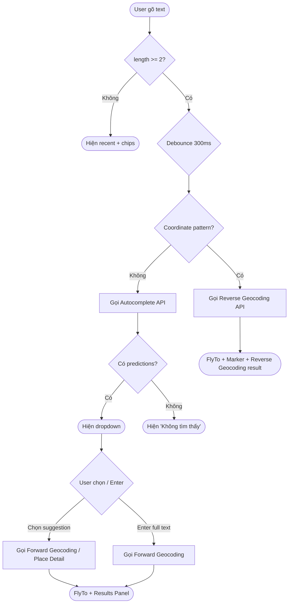
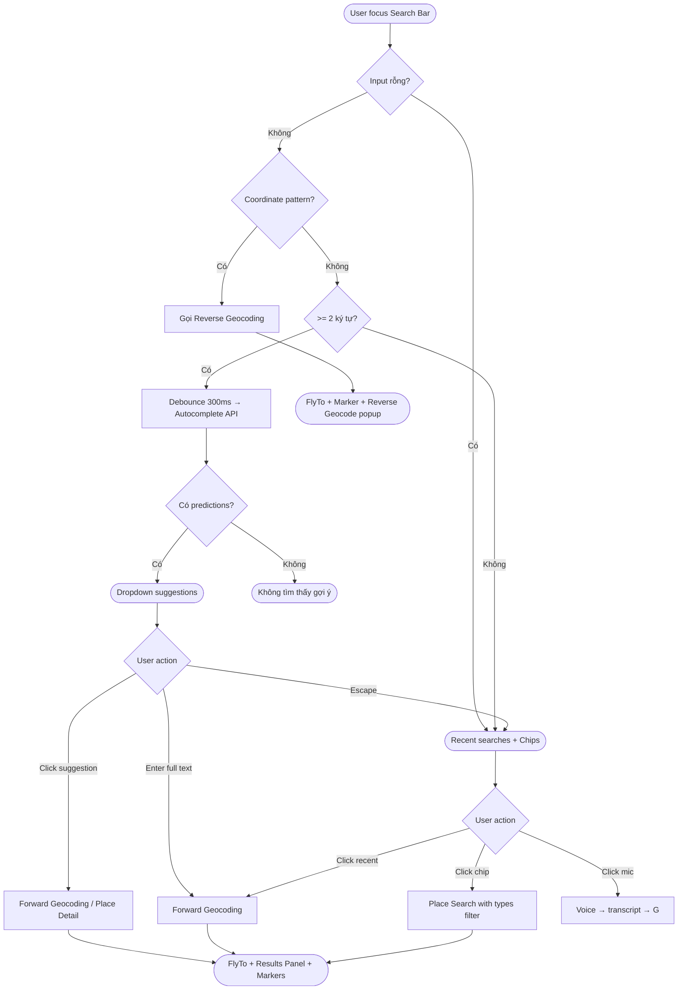

# Unified Search Bar

> **Module:** `maps-viewer`
> **Epic:** Search & Discovery
> **Priority:** `P0`
> **Status:** `Draft`
> **Version:** 1.0
> **Last updated:** 2026-03-09 · Claude
> **COMMON version inherited:** `1.4`
> **COMMON sections overridden:** §5 (NFR extend), §9 (Alert extend)
> **Owner:** Frontend Team / Platform Team
> **Kế thừa từ:** [COMMON_v1.4_supplemented.md](../COMMON_v1.4_supplemented.md) — Auth, Rate Limiting, NFR, Response Contract, Caching, Logging, Monitoring, Security, DoD
> **Depends on:** [FEAT-RG-001 Reverse Geocoding](./reverse-geocoding.md), Forward Geocoding API, Autocomplete API, Place Detail API

---

## Table of Contents

### Part 01 — Background

| #   | Section                                          | Người tham gia      |
| --- | ------------------------------------------------ | ------------------- |
| I   | [Overview](#i-overview)                          | PO · BA             |
| II  | [Out of Scope](#ii-out-of-scope)                 | PO · BA · Architect |
| III | [Decision Summary](#iii-decision-summary-for-v1) | PO · BA · Architect |
| IV  | [Glossary](#iv-glossary)                         | BA · DES · QC       |
| V   | [User Stories](#v-user-stories)                  | PO · BA             |
| VI  | [Traceability Matrix](#vi-traceability-matrix)   | BA · QA · QC        |

### Part 02 — Specifications

| #    | Section                                                          | Người tham gia          |
| ---- | ---------------------------------------------------------------- | ----------------------- |
| VII  | [API Contract & Backend Rules](#vii-api-contract--backend-rules) | Backend Dev · QA · BA   |
| VIII | [UI/UX & Frontend Spec](#viii-uiux--frontend-spec)               | DES · Frontend Dev · QA |
| IX   | [NFR & Performance](#ix-nfr--performance)                        | PO · BA · DevOps · QA   |
| X    | [Risks & Assumptions](#x-risks--assumptions)                     | BA · PO · DevOps        |

### Part 03 — Operations

| #    | Section                                                    | Người tham gia                |
| ---- | ---------------------------------------------------------- | ----------------------------- |
| XI   | [Technical Notes](#xi-technical-notes)                     | Backend Dev · DevOps          |
| XII  | [Monitoring & Alerting](#xii-monitoring--alerting)         | DevOps · QA                   |
| XIII | [Product Analytics Events](#xiii-product-analytics-events) | PO · BA · Frontend Dev · Data |

### Part 04 — Quality & Release

| #     | Section                                                               | Người tham gia      |
| ----- | --------------------------------------------------------------------- | ------------------- |
| XIV   | [Team Dependency & Handoff](#xiv-team-dependency--handoff)            | All Leads           |
| XV    | [Testing Requirements](#xv-testing-requirements)                      | QA · QC · DevOps    |
| XVI   | [Definition of Done](#xvi-definition-of-done)                         | PO · QC             |
| XVII  | [Release / Rollout / Rollback](#xvii-release--rollout--rollback-plan) | PO · DevOps · Leads |
| XVIII | [Sign-off Matrix](#xviii-sign-off-matrix)                             | PO · QC             |

### Part 05 — References

| #   | Section                                        | Người tham gia |
| --- | ---------------------------------------------- | -------------- |
| XIX | [Open Items](#xix-open-items)                  | All            |
| XX  | [Document References](#xx-document-references) | All            |
| XXI | [Changelog](#xxi-changelog)                    | All            |

---
---

# Part 01 — Background

---

## I. Overview

`👤 PO · BA`

### What

Unified Search Bar là thanh tìm kiếm chính trên GTEL Maps Viewer, tích hợp nhiều nguồn dữ liệu vào một điểm nhập duy nhất: Forward Geocoding (tìm địa chỉ), Autocomplete gợi ý real-time, nhận diện tọa độ (trigger Reverse Geocoding), Place/POI search, và Recent Searches. Benchmark: Google Maps Search Bar.

### Why

- **User need:** Người dùng cần một nơi duy nhất để tìm kiếm bất kỳ thông tin gì trên bản đồ — địa chỉ, địa danh, tọa độ, doanh nghiệp — mà không phải phân biệt loại query.
- **Business value:** Search Bar là entry point chính cho mọi tương tác trên Maps Viewer; conversion rate và engagement phụ thuộc trực tiếp vào chất lượng tìm kiếm.
- **Platform integration:** Kết nối và orchestrate nhiều API backend (Forward Geocoding, Reverse Geocoding, Place Search, Autocomplete) thành một trải nghiệm liền mạch.

### In Scope

| Hạng mục              | Mô tả                                                             |
| --------------------- | ----------------------------------------------------------------- |
| Search Bar component  | Input field, clear button, voice icon, focus/blur states          |
| Autocomplete dropdown | Gợi ý real-time khi gõ ≥ 2 ký tự, debounce 300ms                 |
| Forward Geocoding     | Tìm kiếm địa chỉ / tên đường / POI → kết quả trên bản đồ        |
| Coordinate detection  | Nhận diện `lat,lng` decimal degrees → trigger Reverse Geocoding   |
| Recent Searches       | Lưu local, hiển thị khi focus vào Search Bar                      |
| Category chips        | Gợi ý nhanh: Ăn uống, Khách sạn, ATM, Xăng, Bệnh viện...        |
| Results Panel         | Left sidebar (desktop) / Bottom sheet (mobile) hiển thị kết quả   |
| Voice Search          | Microphone icon → Speech-to-Text → trigger search                 |
| Deep link integration | URL `/search/{query}/@lat,lng,zoom` → auto search                 |
| i18n                  | UI copy theo locale app; kết quả theo `language` param            |

---

## II. Out of Scope

`👤 PO · BA · Architect`

> Mục này dùng để **chặn scope creep**.

| Hạng mục                          | Ghi chú                                         |
| --------------------------------- | ------------------------------------------------ |
| Directions / Routing              | Đặc tả riêng `directions.mdx`                   |
| Place Detail full page            | Đặc tả riêng `place-detail.mdx`                 |
| Nearby Search (bản đồ xung quanh) | Đặc tả riêng `nearby-search.mdx`               |
| Saved Places / Bookmarks         | Đặc tả riêng `saved-places.mdx`                 |
| Offline search                    | V1 yêu cầu kết nối internet                     |
| Image / Visual search             | Không hỗ trợ V1                                  |
| Multi-language autocomplete       | V1 chỉ autocomplete theo `vi`; `en` cho results |
| Search history sync across devices | V1 lưu localStorage, không sync              |
| Business listing management       | Không nằm trong phạm vi feature này              |
| Advanced filters (giá, rating)    | V1 chỉ có category chips cơ bản                 |

---

## III. Decision Summary for V1

`👤 PO · BA · Architect`

> Mục tiêu: **đóng các điểm mơ hồ để dev/QA có thể build ngay**.

| Chủ đề                  | Quyết định V1                                            | Tác động                                     |
| ----------------------- | -------------------------------------------------------- | -------------------------------------------- |
| Autocomplete trigger    | **≥ 2 ký tự** + debounce **300ms**                       | Giảm API call, tránh noise khi gõ 1 ký tự    |
| Max suggestions         | **5 items** trong dropdown                               | Cân bằng UX và performance                   |
| Coordinate detection    | Regex cho **decimal degrees** only (`lat,lng`)           | Tránh parser phức tạp (DMS, UTM...)           |
| Recent searches storage | **localStorage**, max **10 items**, FIFO                 | Đơn giản, không cần backend                   |
| Voice search engine     | **Web Speech API** (browser built-in)                    | Không phụ thuộc service bên ngoài             |
| Results panel position  | **Left sidebar** desktop, **Bottom sheet** mobile        | Nhất quán với Google Maps benchmark           |
| Category chips          | **6 chips** mặc định, PO quyết định danh sách           | Dễ thay đổi qua config                       |
| Search on Enter vs auto | **Auto-search sau khi chọn suggestion**; Enter = search full text | Giảm friction, nhất quán                |
| Empty state             | Hiển thị **recent searches** + **category chips**        | Tận dụng không gian, tăng engagement          |
| URL format              | `/search/{query}/@{lat},{lng},{zoom}`                    | Nhất quán với `map-url.mdx`                   |

---

## IV. Glossary

`👤 BA · DES · QC`

> Thuật ngữ chung → xem **[COMMON §1](../COMMON_v1.4_supplemented.md#1-glossary-chung)**.

| Thuật ngữ               | Định nghĩa                                                                    |
| ------------------------ | ------------------------------------------------------------------------------ |
| **Unified Search Bar**   | Thanh tìm kiếm chính trên Maps Viewer, tích hợp multi-source search           |
| **Autocomplete**         | Gợi ý real-time dựa trên input partial text; gọi API sau debounce             |
| **Debounce**             | Kỹ thuật delay API call đến khi user ngừng gõ trong khoảng thời gian nhất định |
| **Forward Geocoding**    | Chuyển đổi text (địa chỉ, tên) → tọa độ `(lat, lng)` + place info            |
| **Category Chip**        | Nút gợi ý nhanh theo danh mục (Ăn uống, ATM...) hiển thị dưới Search Bar     |
| **Results Panel**        | Panel hiển thị danh sách kết quả tìm kiếm (sidebar desktop / sheet mobile)    |
| **Recent Searches**      | Danh sách các query gần đây, lưu trên client                                  |
| **Suggestion Item**      | Một dòng gợi ý trong autocomplete dropdown, gồm icon + text + secondary text  |
| **Search Session**       | Chu kỳ từ lúc user focus Search Bar đến khi chọn kết quả hoặc dismiss         |
| **Voice Search**         | Tìm kiếm bằng giọng nói qua Web Speech API                                   |
| **Coordinate Detection** | Logic nhận diện input dạng `lat,lng` để chuyển sang Reverse Geocoding          |

---

## V. User Stories

`👤 PO · BA`

| ID    | Role     | Goal                                                       | Reason                                     |
| ----- | -------- | ---------------------------------------------------------- | ------------------------------------------ |
| US-01 | End User | Gõ tên địa chỉ và thấy gợi ý ngay khi đang gõ             | Tìm nhanh mà không cần nhớ chính xác       |
| US-02 | End User | Chọn một gợi ý và bản đồ di chuyển đến đó                  | Xem vị trí trực quan trên bản đồ            |
| US-03 | End User | Nhập tọa độ vào Search Bar và thấy địa chỉ tương ứng       | Tra cứu vị trí chính xác                    |
| US-04 | End User | Xem lại những tìm kiếm gần đây khi mở Search Bar           | Quay lại vị trí đã tìm mà không gõ lại     |
| US-05 | End User | Nhấn chip "Ăn uống" để tìm quán ăn gần đây                 | Khám phá nhanh theo nhu cầu phổ biến        |
| US-06 | End User | Dùng giọng nói để tìm kiếm                                 | Hands-free khi đang di chuyển               |
| US-07 | End User | Mở link chia sẻ có sẵn query và thấy kết quả tự động       | Chia sẻ kết quả tìm kiếm qua URL           |
| US-08 | End User | Xóa một mục trong lịch sử tìm kiếm                         | Kiểm soát dữ liệu cá nhân                  |
| US-09 | End User | Xem danh sách kết quả và chọn một kết quả để xem chi tiết  | So sánh và chọn địa điểm phù hợp nhất      |
| US-10 | End User | Nhấn Enter sau khi gõ xong để tìm kiếm full text           | Tìm kiếm khi không muốn chọn gợi ý         |

---

## VI. Traceability Matrix

`👤 BA · QA · QC`

> Nối **User Story → Business Rule → AC → Test/UAT** để refinement, QA và sign-off không bị rời rạc.

| User Story                          | Business Rules         | Acceptance Criteria       | Test / UAT coverage          |
| ----------------------------------- | ---------------------- | ------------------------- | ---------------------------- |
| US-01 Autocomplete gợi ý            | BR-USB-01, BR-USB-02   | B01, B02, B03             | Web UAT 1, 2                 |
| US-02 Chọn gợi ý → bản đồ di chuyển | BR-USB-03             | B04, B05                  | Web UAT 3                    |
| US-03 Nhập tọa độ                   | BR-USB-04              | B06                       | Web UAT 4                    |
| US-04 Recent searches               | BR-USB-05              | B07, B08                  | Web UAT 5                    |
| US-05 Category chips                | BR-USB-06              | B09                       | Web UAT 6                    |
| US-06 Voice search                  | BR-USB-07              | B10                       | Web UAT 7                    |
| US-07 Deep link search              | BR-USB-08              | B11                       | Web UAT 8                    |
| US-08 Xóa lịch sử                  | BR-USB-05              | B08                       | Web UAT 5                    |
| US-09 Results panel                 | BR-USB-03              | B12, B13                  | Web UAT 9                    |
| US-10 Enter full text search        | BR-USB-09              | B14                       | Web UAT 10                   |

### Checklist traceability

- [ ] Mọi user story đều map ít nhất 1 BR và 1 AC
- [ ] Mọi AC P0 đều có test case hoặc UAT step tương ứng
- [ ] Không có business rule nào "mồ côi" không được kiểm chứng

---
---

# Part 02 — Specifications

---

## VII. API Contract & Backend Rules

`👤 Backend Dev · QA · BA`

> Auth, Rate Limiting, Response Contract chung → kế thừa **[COMMON §2–§6](../COMMON_v1.4_supplemented.md)**.
> Unified Search Bar gọi 3 API endpoints chính:

### 7.1 Autocomplete API

```http
GET /v1/autocomplete
Authorization: Bearer {api_key}
Accept: application/json
```

| Parameter       | Type     | Required | Default | Description                                                      |
| --------------- | -------- | -------- | ------- | ---------------------------------------------------------------- |
| `input`         | `string` | ✅       | —       | Partial text, min 2 ký tự, max 256 ký tự                         |
| `location`      | `string` | ❌       | —       | `lat,lng` để bias kết quả gần vị trí                              |
| `radius`        | `int`    | ❌       | 50000   | Bán kính bias (mét), max 50km                                    |
| `language`      | `string` | ❌       | `vi`    | `vi`, `en`                                                       |
| `types`         | `string` | ❌       | all     | `address`, `establishment`, `geocode`                            |
| `session_token` | `string` | ❌       | —       | Token nhóm autocomplete + select thành 1 billing session         |

**Permission scope required:** `search.autocomplete`

**Response `200 OK`:**

```json
{
  "status": "OK",
  "request_id": "uuid-v4",
  "predictions": [
    {
      "place_id": "gtel_place_abc123",
      "description": "136 Nguyễn Huệ, Phường Bến Nghé, Quận 1, Hồ Chí Minh",
      "structured_formatting": {
        "main_text": "136 Nguyễn Huệ",
        "main_text_matched_substrings": [{ "offset": 0, "length": 7 }],
        "secondary_text": "Phường Bến Nghé, Quận 1, Hồ Chí Minh"
      },
      "types": ["street_address"],
      "distance_meters": 1250
    }
  ]
}
```

**Response `200 ZERO_RESULTS`:**

```json
{ "status": "ZERO_RESULTS", "request_id": "uuid-v4", "predictions": [] }
```

**Prediction fields:**

| Field                          | Type     | Mô tả                                              |
| ------------------------------ | -------- | --------------------------------------------------- |
| `place_id`                     | string   | ID duy nhất, dùng để gọi Place Detail               |
| `description`                  | string   | Tên + địa chỉ đầy đủ                                |
| `structured_formatting`        | object   | Text tách main/secondary + highlight match positions |
| `types`                        | string[] | Loại kết quả: `street_address`, `establishment`...   |
| `distance_meters`              | int?     | Khoảng cách đến `location` bias (nếu có)             |

### 7.2 Forward Geocoding API

```http
GET /v1/geocode/forward
Authorization: Bearer {api_key}
Accept: application/json
```

| Parameter  | Type     | Required | Default | Description                         |
| ---------- | -------- | -------- | ------- | ----------------------------------- |
| `address`  | `string` | ✅       | —       | Text tìm kiếm, max 256 ký tự        |
| `location` | `string` | ❌       | —       | `lat,lng` để bias kết quả gần vị trí |
| `language` | `string` | ❌       | `vi`    | `vi`, `en`                          |
| `limit`    | `int`    | ❌       | 5       | Số kết quả tối đa, range `1..10`    |

**Permission scope required:** `geocoding.forward`

**Response `200 OK`:**

```json
{
  "status": "OK",
  "request_id": "uuid-v4",
  "results": [
    {
      "place_id": "gtel_place_abc123",
      "formatted_address": "136 Nguyễn Huệ, Phường Bến Nghé, Quận 1, Hồ Chí Minh, Việt Nam",
      "address_components": [],
      "geometry": {
        "location": { "lat": 10.7769, "lng": 106.7009 },
        "viewport": {
          "northeast": { "lat": 10.7783, "lng": 106.7023 },
          "southwest": { "lat": 10.7755, "lng": 106.6995 }
        }
      },
      "types": ["street_address"]
    }
  ]
}
```

> `address_components` schema giống hệt **[FEAT-RG-001 §7.2](./reverse-geocoding.md)**.

### 7.3 Reverse Geocoding API (for coordinate input)

> Khi Search Bar phát hiện input là tọa độ, Frontend gọi **[Reverse Geocoding API](./reverse-geocoding.md)** đã có:
> `GET /v1/geocode/reverse?lat={lat}&lng={lng}`
> Không duplicate spec — xem FEAT-RG-001 §VII.

### 7.4 Error Codes

> Kế thừa đầy đủ từ **[COMMON §6](../COMMON_v1.4_supplemented.md#6-response-contract--error-codes)**.

| HTTP  | `status`            | Mô tả                                                     | Nguồn       |
| ----- | ------------------- | ---------------------------------------------------------- | ----------- |
| `400` | `MISSING_PARAMETER` | Thiếu `input` (autocomplete) hoặc `address` (forward)     | COMMON      |
| `400` | `INVALID_REQUEST`   | `input` < 2 ký tự, hoặc `limit` ngoài range               | **Feature** |
| `400` | `INVALID_LANGUAGE`  | `language` không phải `vi` hoặc `en`                       | COMMON      |
| `401` | `MISSING_API_KEY`   | Không có API key                                           | COMMON      |
| `401` | `INVALID_API_KEY`   | API key sai hoặc hết hạn                                   | COMMON      |
| `403` | `PERMISSION_DENIED` | Key không có scope cần thiết                               | COMMON      |
| `403` | `API_KEY_DISABLED`  | Key bị vô hiệu hóa                                        | COMMON      |
| `429` | `OVER_QUERY_LIMIT`  | Vượt QPS                                                   | COMMON      |
| `429` | `QUOTA_EXCEEDED`    | Hết quota ngày/tháng                                       | COMMON      |
| `500` | `INTERNAL_ERROR`    | Lỗi hệ thống                                              | COMMON      |
| `504` | `GATEWAY_TIMEOUT`   | Nominatim timeout / down                                   | COMMON      |

### 7.5 Mock Responses cho Frontend

> Frontend dùng mock này để build song song với Backend. Xem thêm **[§XIV Team Handoff](#xiv-team-dependency--handoff)**.

**Mock 1 — Autocomplete Happy Path:**

```json
{
  "status": "OK",
  "request_id": "mock-ac-001",
  "predictions": [
    {
      "place_id": "gtel_mock_001",
      "description": "Nguyễn Huệ, Phường Bến Nghé, Quận 1, Hồ Chí Minh",
      "structured_formatting": {
        "main_text": "Nguyễn Huệ",
        "main_text_matched_substrings": [{ "offset": 0, "length": 6 }],
        "secondary_text": "Phường Bến Nghé, Quận 1, Hồ Chí Minh"
      },
      "types": ["route"],
      "distance_meters": 500
    },
    {
      "place_id": "gtel_mock_002",
      "description": "Phố đi bộ Nguyễn Huệ, Quận 1, Hồ Chí Minh",
      "structured_formatting": {
        "main_text": "Phố đi bộ Nguyễn Huệ",
        "main_text_matched_substrings": [{ "offset": 11, "length": 6 }],
        "secondary_text": "Quận 1, Hồ Chí Minh"
      },
      "types": ["point_of_interest"],
      "distance_meters": 600
    }
  ]
}
```

**Mock 2 — Forward Geocoding Happy Path:**

```json
{
  "status": "OK",
  "request_id": "mock-fg-001",
  "results": [
    {
      "place_id": "gtel_mock_001",
      "formatted_address": "Nguyễn Huệ, Phường Bến Nghé, Quận 1, Hồ Chí Minh, Việt Nam",
      "geometry": {
        "location": { "lat": 10.7735, "lng": 106.7031 },
        "viewport": {
          "northeast": { "lat": 10.7780, "lng": 106.7050 },
          "southwest": { "lat": 10.7690, "lng": 106.7010 }
        }
      },
      "types": ["route"]
    }
  ]
}
```

**Mock 3 — Autocomplete ZERO_RESULTS:**

```json
{ "status": "ZERO_RESULTS", "request_id": "mock-ac-002", "predictions": [] }
```

### 7.6 Business Rules — API

> BR chung (Quota, Coverage, Language) → **[COMMON §4](../COMMON_v1.4_supplemented.md#4-business-rules--quota--coverage)**.

#### BR-USB-01 — Autocomplete trigger

- Chỉ gọi API khi `input.length >= 2`.
- Debounce **300ms** — không gọi API nếu user vẫn đang gõ.
- Nếu user xóa hết text → cancel pending request, hiển thị empty state (recent + chips).

#### BR-USB-02 — Autocomplete limit & dedup

- Tối đa **5 predictions** per request.
- Nếu API trả > 5, client chỉ render 5 đầu tiên.
- Không hiển thị prediction trùng `place_id`.

#### BR-USB-03 — Result selection

- Chọn prediction trong dropdown → gọi Forward Geocoding / Place Detail để lấy tọa độ + metadata.
- Bản đồ `flyTo` vị trí kết quả, sử dụng `viewport` nếu có.
- Nếu kết quả có `place_id` → mở Place Detail panel.

#### BR-USB-04 — Coordinate detection

- Regex pattern: `/^\s*(-?\d+\.?\d*)\s*[,\s]\s*(-?\d+\.?\d*)\s*$/`
- Validate range: `lat ∈ [-90, 90]`, `lng ∈ [-180, 180]`.
- Match → bypass autocomplete, gọi **Reverse Geocoding API** trực tiếp.
- Không match → xử lý như text search bình thường.
- V1 chỉ hỗ trợ **decimal degrees**; DMS, UTM → xử lý như text search (có thể trả ZERO_RESULTS).

#### BR-USB-05 — Recent searches

- Lưu trong **localStorage** key `gtel_maps_recent_searches`.
- Max **10 items**; FIFO — item mới nhất ở đầu, item cũ nhất bị loại.
- Mỗi item lưu: `{ query, place_id?, formatted_address?, timestamp }`.
- User có thể xóa từng item hoặc xóa tất cả.
- Hiển thị khi Search Bar focused và input rỗng.

#### BR-USB-06 — Category chips

- V1: **6 chips** cố định do PO quyết định. Đề xuất mặc định:

| Chip      | Query mapping           | Icon     |
| --------- | ----------------------- | -------- |
| Ăn uống   | `types=restaurant,cafe` | 🍽️ fork |
| Khách sạn | `types=lodging`         | 🏨 bed  |
| ATM       | `types=atm`             | 💳 card |
| Xăng      | `types=gas_station`     | ⛽ fuel  |
| Bệnh viện | `types=hospital`        | 🏥 plus |
| Siêu thị  | `types=supermarket`     | 🛒 cart |

- Nhấn chip → gọi Forward Geocoding / Place Search với `types` filter + location bias từ map center.
- Chip query tạo search session giống text search.

#### BR-USB-07 — Voice search

- Sử dụng **Web Speech API** (`SpeechRecognition`).
- Ngôn ngữ nhận dạng theo locale app (`vi-VN` hoặc `en-US`).
- Kết quả transcript → fill vào Search Bar → trigger autocomplete flow bình thường.
- Nếu browser không hỗ trợ Web Speech API → ẩn microphone icon.
- Timeout voice recognition: **10 giây** không có speech → tự đóng.

#### BR-USB-08 — Deep link search

- URL format: `https://{domain}/search/{query}/@{lat},{lng},{zoom}`
- Khi load page có `/search/{query}` → auto fill Search Bar + trigger Forward Geocoding.
- Nếu có `@lat,lng,zoom` → bản đồ center tại vị trí đó trước khi search.
- Nếu `query` rỗng hoặc không hợp lệ → hiển thị empty state, không gọi API.

#### BR-USB-09 — Enter key behavior

- Enter khi **có suggestion highlighted** → chọn suggestion đó (= click).
- Enter khi **không highlight** → gọi Forward Geocoding với full text input.
- Enter khi **input rỗng** → không làm gì.

### 7.7 Acceptance Criteria — API (AC-A)

`Implement: Backend Dev | Review: QA | Sign-off: QC`

> **Kế thừa từ COMMON:** AC-CMN-AUTH, AC-CMN-RATELIMIT, AC-CMN-RESPONSE, AC-CMN-CACHE, AC-CMN-LOG.

#### AC-A01 · Autocomplete Happy Path

```gherkin
Given  API key hợp lệ, có scope "search.autocomplete"
And    input = "Nguyen Hue"
When   GET /v1/autocomplete?input=Nguyen+Hue&language=vi
Then   HTTP 200, "status": "OK"
And    "predictions" chứa ≥ 1 phần tử
And    mỗi prediction có "place_id", "description", "structured_formatting"
```

#### AC-A02 · Autocomplete highlight matching

```gherkin
Given  input = "nguyen"
When   API trả về predictions
Then   "main_text_matched_substrings" chứa ít nhất 1 match
And    offset + length khớp vị trí "nguyen" trong "main_text"
```

#### AC-A03 · Autocomplete input validation

| Trường hợp         | Input       | HTTP | `status`            |
| ------------------- | ----------- | ---- | ------------------- |
| Input < 2 ký tự     | `input=N`   | 400  | `INVALID_REQUEST`   |
| Input rỗng          | `input=`    | 400  | `MISSING_PARAMETER` |
| Input > 256 ký tự   | 257 chars   | 400  | `INVALID_REQUEST`   |

#### AC-A04 · Forward Geocoding Happy Path

```gherkin
Given  API key hợp lệ, có scope "geocoding.forward"
And    address = "136 Nguyễn Huệ Quận 1"
When   GET /v1/geocode/forward?address=136+Nguyen+Hue+Quan+1&language=vi
Then   HTTP 200, "status": "OK"
And    "results" chứa ≥ 1 phần tử
And    mỗi result có "place_id", "formatted_address", "geometry.location", "geometry.viewport"
```

#### AC-A05 · Forward Geocoding ZERO_RESULTS

```gherkin
Given  address = "xyzabc123notfound"
When   GET /v1/geocode/forward?address=xyzabc123notfound
Then   HTTP 200, "status": "ZERO_RESULTS", "results": []
```

#### AC-A06 · Forward Geocoding limit parameter

```gherkin
Given  address = "Nguyễn Huệ" and limit = 3
When   GET /v1/geocode/forward?address=...&limit=3
Then   "results.length" ≤ 3

Given  limit = 0 hoặc limit = 11
Then   HTTP 400, "status": "INVALID_REQUEST"
```

#### AC-A07 · Location bias

```gherkin
Given  location = "10.7769,106.7009" (HCM) and input = "Nguyễn Huệ"
When   gọi autocomplete
Then   kết quả ưu tiên các địa điểm gần HCM hơn Hà Nội
```

### 7.8 Flow — Autocomplete + Search



---

## VIII. UI/UX & Frontend Spec

`👤 DES · Frontend Dev · QA`

### 8.1 Triggers & Entry Points

| ID  | Trigger                             | Nền tảng    | Input             | AC riêng |
| --- | ----------------------------------- | ----------- | ----------------- | -------- |
| T01 | Focus Search Bar (click / tap)      | Web, Mobile | —                 | B07      |
| T02 | Gõ text ≥ 2 ký tự                   | Web, Mobile | Partial text      | B01–B03  |
| T03 | Chọn suggestion trong dropdown      | Web, Mobile | `place_id`        | B04, B05 |
| T04 | Nhấn Enter (full text search)       | Web, Mobile | Full query string | B14      |
| T05 | Nhập tọa độ decimal degrees         | Web, Mobile | `lat,lng`         | B06      |
| T06 | Nhấn category chip                  | Web, Mobile | Category type     | B09      |
| T07 | Nhấn microphone icon (voice search) | Web, Mobile | Speech transcript | B10      |
| T08 | Deep link URL `/search/{query}`     | Web, Mobile | URL params        | B11      |
| T09 | Nhấn recent search item             | Web, Mobile | Stored query      | B07      |
| T10 | Nhấn clear (X) button              | Web, Mobile | —                 | B15      |

### 8.2 States Inventory

| State              | Mô tả                         | Component                        |
| ------------------ | ------------------------------ | -------------------------------- |
| `idle`             | Thanh search chưa được focus   | Search Bar collapsed (mobile)    |
| `focused_empty`    | Focused, chưa gõ gì           | Recent searches + category chips |
| `typing`           | Đang gõ, chờ debounce         | Input text, cancel old request   |
| `loading_suggest`  | Debounce xong, chờ API        | Dropdown skeleton / spinner      |
| `suggestions`      | Có predictions                 | Dropdown list                    |
| `zero_suggest`     | Autocomplete trả rỗng         | "Không tìm thấy gợi ý"          |
| `loading_results`  | Đang gọi Forward Geocoding    | Results panel skeleton           |
| `results`          | Có kết quả tìm kiếm           | Results panel + markers          |
| `zero_results`     | Forward Geocoding trả rỗng    | "Không tìm thấy kết quả"        |
| `error`            | API lỗi / timeout             | Toast lỗi                        |
| `voice_listening`  | Đang nghe giọng nói           | Microphone active + animation    |
| `voice_no_support` | Browser không hỗ trợ Speech   | Mic icon hidden                  |
| `coordinate_detect`| Input là tọa độ hợp lệ        | Trigger reverse geocoding flow   |

### 8.3 Components, Responsive & Typography

#### Component Inventory

| Component               | Dùng trong     | Trạng thái    |
| ----------------------- | -------------- | ------------- |
| Search Bar input        | All triggers   | Existing / DS |
| Clear (X) button        | Khi có input   | Existing / DS |
| Microphone icon         | Voice search   | **New**       |
| Autocomplete dropdown   | T02            | **New**       |
| Suggestion item         | Dropdown       | **New**       |
| Highlight match text    | Suggestion     | **New**       |
| Recent search item      | T01 focus      | **New**       |
| Category chip           | T01, T06       | **New**       |
| Results panel (sidebar) | Desktop        | **New**       |
| Results panel (sheet)   | Mobile         | **New**       |
| Result list item        | Results panel  | **New**       |
| Result marker (numbered)| Map            | **New**       |
| Skeleton loader         | Loading states | Existing / DS |
| Voice listening overlay | T07            | **New**       |

#### Responsive Behavior

| Breakpoint                 | Search Bar             | Autocomplete dropdown | Results panel       |
| -------------------------- | ---------------------- | --------------------- | ------------------- |
| Mobile portrait (< 768px)  | Full width, expandable | Full width overlay    | Bottom sheet        |
| Mobile landscape (< 768px) | Full width             | Full width            | Bottom sheet        |
| Tablet (768px–1024px)      | Fixed width ~400px     | Below search bar      | Left sidebar ~400px |
| Desktop (> 1024px)         | Fixed width ~400px     | Below search bar      | Left sidebar ~400px |

#### Typography

- Font: **Be Vietnam Pro**
- Search input: 16px / 400 (tránh zoom trên iOS)
- Suggestion main_text: 14px / 500
- Suggestion secondary_text: 12px / 400 / color-secondary
- Result title: 14px / 500
- Result address: 12px / 400

#### Design Asset Status

| Component / State                   | Figma    | Status      |
| ----------------------------------- | -------- | ----------- |
| Search Bar — idle (desktop)         | _(link)_ | ⬜ Chờ link |
| Search Bar — focused_empty          | _(link)_ | ⬜ Chờ link |
| Search Bar — typing + dropdown      | _(link)_ | ⬜ Chờ link |
| Autocomplete dropdown — suggestions | _(link)_ | ⬜ Chờ link |
| Autocomplete dropdown — zero        | _(link)_ | ⬜ Chờ link |
| Recent searches panel               | _(link)_ | ⬜ Chờ link |
| Category chips row                  | _(link)_ | ⬜ Chờ link |
| Results panel — desktop sidebar     | _(link)_ | ⬜ Chờ link |
| Results panel — mobile bottom sheet | _(link)_ | ⬜ Chờ link |
| Result list item                    | _(link)_ | ⬜ Chờ link |
| Voice listening overlay             | _(link)_ | ⬜ Chờ link |
| Search Bar — mobile collapsed       | _(link)_ | ⬜ Chờ link |

> DES cần fill link + đổi status sang ✅ Ready trước khi Frontend bắt đầu build UI tương ứng.

### 8.4 Accessibility & UX Content

#### Accessibility baseline

| Hạng mục      | Rule                                                                     |
| ------------- | ------------------------------------------------------------------------ |
| Keyboard      | Arrow keys navigate suggestions; Enter chọn; Escape đóng dropdown       |
| Focus state   | Focus ring rõ ràng trên input, suggestions, chips                        |
| Screen reader | `role="combobox"`, `aria-expanded`, `aria-activedescendant` cho dropdown |
| Loading state | `aria-live="polite"` thông báo số kết quả khi load xong                  |
| Touch target  | Suggestion item, chip, mic icon tối thiểu ~44px                          |
| Contrast      | Text và icon đạt contrast phù hợp design system                         |
| Voice search  | Có visual indicator (animation) khi đang nghe                            |

#### UX copy rules

| Tình huống             | Copy                                             |
| ---------------------- | ------------------------------------------------ |
| Placeholder            | `Tìm kiếm trên GTEL Maps`                        |
| Zero suggestions       | `Không tìm thấy gợi ý nào cho "{query}"`          |
| Zero results           | `Không tìm thấy kết quả cho "{query}"`            |
| Error / timeout        | `Không thể tải kết quả, vui lòng thử lại`        |
| Voice listening        | `Đang nghe...`                                    |
| Voice no speech        | `Không nhận được giọng nói, vui lòng thử lại`     |
| Voice no support       | _(ẩn mic icon, không cần copy)_                   |
| Recent searches header | `Tìm kiếm gần đây`                               |
| Clear all recent       | `Xóa tất cả`                                     |
| Coordinate detected    | _(tự động chuyển sang reverse geocoding, không cần copy riêng)_ |

#### i18n rules

- UI copy (placeholder, headers, error messages) mặc định theo locale app.
- Kết quả search theo `language` parameter của API.
- Nút / chip / helper text phải có key i18n, không hard-code.

#### QA accessibility checks

- [ ] Tab / arrow key navigation hoạt động trên dropdown
- [ ] Screen reader đọc được suggestion khi highlight
- [ ] Escape đóng dropdown, focus quay lại input
- [ ] Mic icon có `aria-label` rõ nghĩa
- [ ] Category chips accessible qua keyboard

### 8.5 Acceptance Criteria — UI (AC-B)

`Implement: Frontend Dev | Design: DES | Review: QA | Sign-off: QC`

#### AC-B01 · Autocomplete trigger (T02)

```gherkin
Given  user focus Search Bar và gõ ≥ 2 ký tự
When   ngừng gõ 300ms (debounce)
Then   gọi Autocomplete API với input hiện tại
And    hiển thị dropdown với predictions

Given  user gõ 1 ký tự
Then   không gọi API, giữ nguyên empty state hoặc recent searches
```

#### AC-B02 · Autocomplete dropdown rendering

```gherkin
Given  Autocomplete API trả về predictions
Then   dropdown hiển thị tối đa 5 items
And    mỗi item có icon + main_text (bold matched substring) + secondary_text
And    dropdown xuất hiện trong ≤ 100ms sau khi nhận response
```

#### AC-B03 · Autocomplete keyboard navigation

```gherkin
Given  dropdown đang hiển thị
When   nhấn Arrow Down / Arrow Up
Then   highlight di chuyển qua các suggestion items
And    screen reader thông báo suggestion đang highlight

When   nhấn Escape
Then   dropdown đóng, focus quay lại input, text giữ nguyên
```

#### AC-B04 · Select suggestion (T03)

```gherkin
Given  dropdown hiển thị, user click / tap suggestion
Then   text trong Search Bar thay bằng description của suggestion
And    dropdown đóng
And    gọi Forward Geocoding / Place Detail với place_id
And    lưu query vào recent searches
```

#### AC-B05 · Map response to selection

```gherkin
Given  Forward Geocoding trả về kết quả với geometry
Then   bản đồ flyTo vị trí kết quả
And    nếu có viewport → fitBounds(viewport)
And    nếu chỉ có location → flyTo(location, zoom=17)
And    marker xuất hiện tại vị trí

Given  kết quả có place_id
Then   mở Place Detail panel
```

#### AC-B06 · Coordinate input (T05)

```gherkin
Given  user nhập "10.7769, 106.7009" vào Search Bar
When   pattern match decimal degrees detected
Then   không gọi Autocomplete API
And    gọi Reverse Geocoding API với lat=10.7769, lng=106.7009
And    bản đồ flyTo tọa độ + marker + popup địa chỉ

Given  nhập "10.7769, 999" (lng out of range)
Then   xử lý như text search bình thường (Forward Geocoding)
```

#### AC-B07 · Focus empty state (T01)

```gherkin
Given  user click / focus vào Search Bar, input rỗng
Then   hiển thị recent searches (nếu có) + category chips
And    recent searches sắp xếp mới nhất lên đầu

Given  không có recent searches
Then   chỉ hiển thị category chips
```

#### AC-B08 · Recent searches management

```gherkin
Given  recent searches đang hiển thị
When   user nhấn icon X trên một item
Then   item đó bị xóa khỏi danh sách và localStorage

When   user nhấn "Xóa tất cả"
Then   tất cả recent searches bị xóa

When   user nhấn vào một recent search item
Then   text fill vào Search Bar + trigger Forward Geocoding
```

#### AC-B09 · Category chips (T06)

```gherkin
Given  user nhấn chip "Ăn uống"
When   chip activated
Then   gọi Forward Geocoding / Place Search với types=restaurant,cafe
And    location bias = map center hiện tại
And    Results panel hiển thị kết quả
And    markers xuất hiện trên bản đồ
```

#### AC-B10 · Voice search (T07)

```gherkin
Given  user nhấn microphone icon
When   browser hỗ trợ Web Speech API
Then   overlay "Đang nghe..." hiển thị + mic animation
And    bắt đầu recognition

Given  speech detected
Then   transcript fill vào Search Bar
And    trigger autocomplete flow bình thường

Given  10 giây không có speech
Then   tự đóng, thông báo "Không nhận được giọng nói"

Given  browser không hỗ trợ Web Speech API
Then   microphone icon bị ẩn
```

#### AC-B11 · Deep link search (T08)

```gherkin
Given  URL https://{domain}/search/Nguyen+Hue/@10.77,106.70,15
Then   Search Bar fill text "Nguyen Hue"
And    bản đồ center tại 10.77, 106.70, zoom 15
And    auto trigger Forward Geocoding

Given  URL https://{domain}/search/ (query rỗng)
Then   hiển thị empty state, không gọi API
```

#### AC-B12 · Results panel rendering

```gherkin
Given  Forward Geocoding trả về ≥ 1 results
Then   Results panel mở (sidebar desktop / bottom sheet mobile)
And    mỗi result item hiển thị: tên, địa chỉ, khoảng cách (nếu có)
And    markers đánh số tương ứng trên bản đồ
```

#### AC-B13 · Results panel interaction

```gherkin
Given  Results panel đang hiển thị
When   user click / tap một result item
Then   bản đồ flyTo vị trí đó
And    mở Place Detail panel (nếu có place_id)

When   user hover một result item (desktop)
Then   marker tương ứng highlight trên bản đồ
```

#### AC-B14 · Enter full text search (T04)

```gherkin
Given  user gõ "Bưu điện thành phố" và nhấn Enter
When   không có suggestion được highlight
Then   gọi Forward Geocoding với address = "Bưu điện thành phố"
And    hiển thị kết quả trong Results panel

Given  user nhấn Enter khi input rỗng
Then   không làm gì
```

#### AC-B15 · Clear button (T10)

```gherkin
Given  Search Bar có text
When   nhấn clear (X) button
Then   text bị xóa
And    dropdown đóng, results panel đóng
And    markers kết quả bị xóa
And    hiển thị empty state (recent + chips)
And    focus vẫn ở Search Bar
```

### 8.6 Flow — UI Search Session



### 8.7 Trigger → AC Quick Reference

> Bảng tóm tắt để QA kiểm coverage.

| Trigger                 | AC áp dụng   |
| ----------------------- | ------------ |
| T01 Focus empty         | B07          |
| T02 Gõ text             | B01, B02, B03|
| T03 Select suggestion   | B04, B05     |
| T04 Enter full text     | B14          |
| T05 Coordinate input    | B06          |
| T06 Category chip       | B09          |
| T07 Voice search        | B10          |
| T08 Deep link           | B11          |
| T09 Recent search click | B07, B08     |
| T10 Clear button        | B15          |

---

## IX. NFR & Performance

`👤 PO · BA · DevOps · QA`

> NFR chung → **[COMMON §5](../COMMON_v1.4_supplemented.md#5-non-functional-requirements)**.

### Extend — Performance

| Chỉ số                       | Giá trị COMMON | Extend USB      | Rule                                        |
| ----------------------------- | -------------- | --------------- | ------------------------------------------- |
| Autocomplete P95 (cache MISS) | ≤ 500ms        | **≤ 200ms**     | Phải nhanh hơn typing speed                 |
| Forward Geocoding P95         | ≤ 500ms        | Kế thừa         | —                                           |
| Throughput autocomplete       | ≥ 100 RPS      | **≥ 1000 RPS**  | Nhiều user gõ đồng thời → high request rate |

### UI Performance

| Chỉ số                                    | Yêu cầu                           |
| ------------------------------------------ | ---------------------------------- |
| Dropdown render sau API response           | ≤ 100ms                           |
| FlyTo animation sau select                 | ≤ 300ms bắt đầu                   |
| Results panel render sau Forward Geocoding | ≤ 200ms                           |
| Debounce interval                          | 300ms (không đổi)                 |
| Input responsiveness                       | Không bị lag khi gõ nhanh (60fps) |
| CLS khi dropdown mở / đóng                | < 0.1                             |

---

## X. Risks & Assumptions

`👤 BA · PO · DevOps`

### Assumptions

| #   | Giả định                                                       | Owner   |
| --- | --------------------------------------------------------------- | ------- |
| A1  | Forward Geocoding API + Autocomplete API đã ready trên staging  | Backend |
| A2  | Reverse Geocoding API đã live (FEAT-RG-001)                     | Backend |
| A3  | Nominatim hỗ trợ forward geocoding (search endpoint)            | DevOps  |
| A4  | Web Speech API available trên Chrome, Safari, Edge               | Frontend|
| A5  | Design System có sẵn input, dropdown, chip components            | DES     |
| A6  | Place Detail API có endpoint riêng để lấy metadata               | Backend |

### Risks

| #   | Rủi ro                                              | Khả năng | Ảnh hưởng | Mitigation                                          |
| --- | --------------------------------------------------- | -------- | --------- | --------------------------------------------------- |
| R1  | Autocomplete latency > 200ms → UX không mượt        | 🟡       | 🔴        | Cache popular queries, optimize Nominatim index     |
| R2  | Web Speech API không hoạt động trên Firefox          | 🟡       | 🟡        | Graceful degradation: ẩn mic icon                   |
| R3  | Autocomplete gây excessive API calls → billing cao  | 🟡       | 🟡        | Session token, debounce, client-side cache           |
| R4  | Vietnamese diacritics handling trong search           | 🟡       | 🟡        | Normalize input: tìm cả có dấu và không dấu         |
| R5  | Recent searches bị mất khi user xóa browser data     | 🟢       | 🟢        | Expected behavior, document rõ                      |
| R6  | Category chips không phù hợp ngữ cảnh vùng miền     | 🟢       | 🟡        | PO review danh sách chips, hỗ trợ config per region |

---
---

# Part 03 — Operations

---

## XI. Technical Notes

`👤 Backend Dev · DevOps`

### Architecture & Dependencies

| Component           | Service                 | Namespace        | Failure policy             |
| ------------------- | ----------------------- | ---------------- | -------------------------- |
| Autocomplete Engine | Nominatim (search)      | `maps-geocoding` | `504 GATEWAY_TIMEOUT`      |
| Forward Geocoding   | Nominatim (search)      | `maps-geocoding` | `504 GATEWAY_TIMEOUT`      |
| Reverse Geocoding   | Nominatim (reverse)     | `maps-geocoding` | `504 GATEWAY_TIMEOUT`      |
| Cache Layer         | Redis Cluster           | `maps-cache`     | Bypass → `X-Cache: BYPASS` |
| API Gateway         | Kong Gateway            | `maps-gateway`   | —                          |
| Usage Tracking      | Kafka → ClickHouse      | `maps-analytics` | Async, không block request |
| Speech Recognition  | Web Speech API (client) | —                | Graceful degradation       |

### Nominatim query mapping

```text
Autocomplete:
  GET /v1/autocomplete?input=nguyen+hue&location=10.77,106.70
    → GET /search?q=nguyen+hue&format=jsonv2&addressdetails=1&limit=5&viewbox=...&bounded=0

Forward Geocoding:
  GET /v1/geocode/forward?address=136+Nguyen+Hue&limit=5
    → GET /search?q=136+Nguyen+Hue&format=jsonv2&addressdetails=1&limit=5
```

### Caching

| Thông số                | Giá trị                                                          |
| ----------------------- | ---------------------------------------------------------------- |
| Autocomplete key        | `ac:{normalized_input}:{lang}:{location_3dp}`                    |
| Forward Geocoding key   | `fgeo:{normalized_address}:{lang}:{limit}`                       |
| TTL autocomplete        | 1h (ngắn hơn geocoding vì dữ liệu business thay đổi nhanh)      |
| TTL forward geocoding   | 24h                                                              |
| Input normalization     | lowercase + trim + collapse whitespace + remove diacritics for cache key |

### Logging (bổ sung fields)

| Field              | Type   | Privacy rule                                        |
| ------------------ | ------ | --------------------------------------------------- |
| `query`            | string | **Hash** — không log raw query vì có thể chứa PII  |
| `query_length`     | int    | —                                                   |
| `prediction_count` | int    | —                                                   |
| `result_count`     | int    | —                                                   |
| `is_coordinate`    | bool   | —                                                   |
| `trigger_type`     | string | `autocomplete`, `forward`, `reverse`, `voice`, `chip`, `deeplink` |
| `session_token`    | string | —                                                   |

---

## XII. Monitoring & Alerting

`👤 DevOps · QA`

> Panels và alerts chung → **[COMMON §9](../COMMON_v1.4_supplemented.md#9-monitoring--alerting-chung)**.

### Dashboard bổ sung

| Panel                  | Metric                          | Mô tả                            |
| ---------------------- | ------------------------------- | --------------------------------- |
| Autocomplete Latency   | `autocomplete_response_ms`      | P50 / P95 / P99 latency          |
| Autocomplete QPS       | `autocomplete_rps`              | Requests per second               |
| Forward Geocoding Rate | `fgeo_rps`                      | RPS forward geocoding             |
| Search ZERO_RESULTS    | `search_zero_results_rate`      | % query không có kết quả          |
| Voice Search Usage     | `voice_search_triggered_count`  | Số lần voice search được dùng     |
| Suggestion CTR         | `suggestion_click_through_rate` | % user chọn suggestion vs gõ thêm |

### Alert bổ sung

| Alert                     | Condition                | Severity | Notify         |
| ------------------------- | ------------------------ | -------- | -------------- |
| High Autocomplete Latency | P95 > 300ms trong 5 phút | 🟡       | DevOps         |
| Autocomplete Down         | Error rate > 10% / 5min  | 🔴       | DevOps on-call |
| High ZERO_RESULTS Search  | > 30% trong 1 giờ        | 🟡       | BA + GIS       |
| Forward Geocoding Latency | P95 > 700ms trong 5 phút | 🟡       | DevOps         |

---

## XIII. Product Analytics Events

`👤 PO · BA · Frontend Dev · Data`

> Khác với operational logging ở COMMON: mục này đo **hành vi người dùng / mức độ dùng tính năng**.

| Event name                         | Khi nào bắn                   | Thuộc tính chính                                  |
| ---------------------------------- | ----------------------------- | ------------------------------------------------- |
| `search_bar_focused`               | User focus vào Search Bar     | `surface`, `has_recent`, `locale`                  |
| `autocomplete_triggered`           | Gọi Autocomplete API         | `query_length`, `trigger=typing\|voice`, `locale`  |
| `autocomplete_suggestion_shown`    | Dropdown hiển thị predictions | `prediction_count`, `query_length`                 |
| `autocomplete_suggestion_selected` | User chọn suggestion         | `suggestion_index`, `query_length`, `place_types`  |
| `search_submitted`                 | Enter full text search        | `query_length`, `is_coordinate`, `trigger`         |
| `search_results_shown`             | Results panel hiển thị        | `result_count`, `query_length`, `trigger`          |
| `search_result_selected`           | User chọn result từ panel     | `result_index`, `place_types`                      |
| `search_zero_results`              | Forward Geocoding trả rỗng   | `query_length`, `trigger`                          |
| `category_chip_clicked`            | User nhấn category chip       | `chip_name`, `surface`                             |
| `voice_search_started`             | User nhấn mic icon            | `surface`, `browser`                               |
| `voice_search_completed`           | Speech → transcript thành công | `transcript_length`, `duration_ms`                |
| `voice_search_failed`              | Timeout hoặc không nhận speech | `reason=timeout\|no_speech\|error`                |
| `recent_search_clicked`            | User nhấn recent search item  | `item_age_hours`, `surface`                        |
| `recent_search_deleted`            | User xóa một item             | `surface`                                          |
| `recent_search_cleared_all`        | User xóa tất cả recent       | `item_count`, `surface`                            |
| `search_bar_cleared`               | User nhấn X clear             | `had_results`, `query_length`                      |
| `coordinate_detected`              | Input nhận diện là tọa độ     | `surface`                                          |

### Guardrails

- Không gửi raw `query` vào product analytics event — chỉ gửi `query_length`.
- Không gửi `place_id` cụ thể — chỉ gửi `place_types`.
- Event phải không block UI và không làm chậm flow chính.
- Tọa độ nếu cần analytics → tối đa 2dp (~1.1km resolution).

---
---

# Part 04 — Quality & Release

---

## XIV. Team Dependency & Handoff

`👤 All Leads`

> Mục tiêu: các team build **song song** ở giai đoạn đầu, hội tụ tại integration.

### Handoff Sequence

| Phase                              | Output                                    | Owner              | Blocked by    | Target     |
| ---------------------------------- | ----------------------------------------- | ------------------ | ------------- | ---------- |
| P0 — API Contracts finalized       | §VII Autocomplete + Forward Geocoding      | BA + Backend Lead  | —             | Sprint 0   |
| P1 — Mock APIs ready               | Stub endpoints trả mock §7.5               | Backend Dev        | P0            | Sprint 0   |
| P2 — Design assets ready           | Figma §8.3 status = ✅                     | DES                | P0            | Sprint 0–1 |
| P3 — Reverse Geocoding live        | FEAT-RG-001 on staging                    | Backend Dev        | FEAT-RG-001   | Sprint 0–1 |
| P4 — Backend APIs on staging       | Autocomplete + Forward Geocoding passing   | Backend Dev        | P3, Nominatim | Sprint 1–2 |
| P5 — Frontend UI on staging (mock) | Search Bar + dropdown + results panel      | Frontend Dev       | P1, P2        | Sprint 1–2 |
| P6 — Integration                   | Frontend ↔ real APIs on staging            | Frontend + Backend | P4, P5        | Sprint 2   |
| P7 — UAT                           | Full flow testing                         | QA / QC            | P6            | Sprint 2–3 |
| P8 — Perf test                     | Autocomplete P95 ≤ 200ms, 1000 RPS        | DevOps             | P4            | Sprint 2   |

### Parallel Work Windows

```text
Sprint 0:    [BA: API Contract] [Backend: Mock APIs] [DES: Figma]
Sprint 0–1:  [Backend: RG live (dependency)]
Sprint 1:    [Backend: AC + FG APIs ────] [Frontend: UI + Mock ────] [DevOps: Infra]
Sprint 2:    [Integration ──] [Perf test] [UAT ────]
Sprint 2–3:  [Bug fix] [Sign-off] [Rollout prep]
```

### Handoff Artifacts

| Từ                 | Đến          | Artifact                      | Format             |
| ------------------ | ------------ | ----------------------------- | ------------------ |
| BA → Backend       | API Contract | §VII của doc này              | Markdown           |
| BA → Frontend      | UI Spec      | §VIII của doc này             | Markdown           |
| Backend → Frontend | Mock APIs    | §7.5 mock responses           | JSON / stub server |
| DES → Frontend     | Design       | Figma link trong §8.3         | Figma              |
| Backend → QA       | API testable | Staging URL + sample requests | Postman collection |
| DevOps → All       | Infra ready  | Staging environment URL       | Slack notification |

---

## XV. Testing Requirements

`👤 QA · QC · DevOps`

### Test Types

| Test Type        | Scope                                         | Owner            | Tool             | Môi trường   |
| ---------------- | --------------------------------------------- | ---------------- | ---------------- | ------------ |
| Unit Test        | Coordinate detection, debounce, input parsing | Frontend Dev     | Jest / Vitest    | Local / CI   |
| Unit Test        | Nominatim → API contract mapping              | Backend Dev      | Jest / Pytest    | Local / CI   |
| Integration Test | End-to-end: auth, cache, autocomplete chain   | Backend Dev      | Postman / k6     | Staging      |
| Performance Test | Autocomplete 1000 RPS, P95 ≤ 200ms            | DevOps           | k6               | Staging      |
| UAT              | 10 trigger × happy path + edge case           | QA / QC          | Manual           | Staging      |
| Security Test    | Injection via search input                    | Backend Dev      | OWASP ZAP        | Staging      |
| Contract Test    | Headers + JSON schema                         | Backend Dev / QA | Postman / custom | CI + Staging |
| Browser Compat   | Voice search, dropdown, responsive            | QA               | Manual           | Staging      |

### UAT Script

**API:**

- [ ] Autocomplete `input=Nguyen` → `200 OK` + predictions
- [ ] Autocomplete `input=N` (1 char) → `400 INVALID_REQUEST`
- [ ] Forward Geocoding `address=Bến Thành` → `200 OK` + results
- [ ] Forward Geocoding `address=xyznotfound` → `200 ZERO_RESULTS`
- [ ] Không có API key → `401 MISSING_API_KEY`
- [ ] Request thứ 2 cùng input → `X-Cache: HIT`

**UI — Web:**

- [ ] Focus Search Bar → hiển thị recent searches + chips
- [ ] Gõ "Nguyen Hue" → dropdown autocomplete xuất hiện sau debounce
- [ ] Click suggestion → bản đồ di chuyển + results panel
- [ ] Enter "Bưu điện thành phố" → Forward Geocoding + results
- [ ] Nhập "10.7769, 106.7009" → detect coordinate → reverse geocoding
- [ ] Nhấn chip "Ăn uống" → kết quả restaurant/cafe
- [ ] Nhấn mic icon → voice listening overlay (Chrome/Edge)
- [ ] URL `/search/Nguyen+Hue/@10.77,106.70,15` → auto search
- [ ] Nhấn X clear → xóa tất cả, hiển thị empty state
- [ ] Arrow keys navigate dropdown + Enter chọn

**UI — Mobile:**

- [ ] Search Bar collapsed khi không focus
- [ ] Bottom sheet hiển thị kết quả
- [ ] Touch-friendly: suggestion items, chips ≥ 44px

### Test Data

| ID    | Input                        | Type         | Kết quả mong đợi                |
| ----- | ---------------------------- | ------------ | -------------------------------- |
| TD-01 | "Nguyễn Huệ"                 | Autocomplete | ≥ 1 prediction liên quan         |
| TD-02 | "136 Nguyen Hue Q1"          | Forward Geo  | Address ở Quận 1 HCM             |
| TD-03 | "Bưu điện thành phố"         | Forward Geo  | Central Post Office HCM          |
| TD-04 | "10.7769, 106.7009"          | Coordinate   | Reverse Geocoding → address HCM  |
| TD-05 | "xyzabc123"                  | Forward Geo  | `ZERO_RESULTS`                   |
| TD-06 | "N" (1 char)                 | Autocomplete | `400 INVALID_REQUEST`            |
| TD-07 | "Ăn uống" chip               | Category     | Restaurants/cafes near map center |
| TD-08 | "ATM" chip                   | Category     | ATMs near map center             |
| TD-09 | Voice "Sân bay Tân Sơn Nhất" | Voice        | Forward Geocoding → airport       |
| TD-10 | "nguyễn huệ" (lowercase)     | Autocomplete | Kết quả tương đương "Nguyễn Huệ" |

---

## XVI. Definition of Done

`👤 PO · QC`

> Checklist chung → **[COMMON §11](../COMMON_v1.4_supplemented.md#11-definition-of-done-chung)**.

### Backend APIs

- [ ] AC-A01 đến A07 pass trên staging
- [ ] Autocomplete perf test pass: P95 ≤ 200ms tại 1000 RPS
- [ ] JSON schema và headers contract test pass
- [ ] Session token billing logic verified

### Frontend UI

- [ ] AC-B01 đến B15 pass trên staging
- [ ] Test đủ 10 trigger trên Chrome / Safari / Firefox / Edge
- [ ] Responsive đúng trên 4 breakpoint
- [ ] Keyboard navigation hoàn chỉnh
- [ ] Voice search graceful degradation trên Firefox

### Sign-off

- [ ] QC: UAT Script 100% pass
- [ ] PO: Demo + business requirements verified
- [ ] DevOps: Infra, monitoring, alert sẵn sàng production

---

## XVII. Release / Rollout / Rollback Plan

`👤 PO · DevOps · Frontend Lead · Backend Lead`

### Release strategy

| Hạng mục      | Quyết định V1                                    |
| ------------- | ------------------------------------------------ |
| Release type  | Canary / phased rollout                          |
| Feature flag  | Có — `unified_search_bar_v1` cho toàn bộ feature |
| API exposure  | Mở trước cho Maps Viewer, sau đó external         |
| Rollout order | Staging → Internal canary → Full prod            |
| Dependency    | FEAT-RG-001 phải đã live trước khi rollout       |

### Rollout phases

| Phase | Traffic           | Gate                              |
| ----- | ----------------- | --------------------------------- |
| P0    | Staging 100%      | Contract + UAT + perf pass        |
| P1    | Internal prod 10% | Không có critical alert trong 24h |
| P2    | Internal prod 50% | Latency / error rate ổn định      |
| P3    | Prod 100%         | PO + DevOps xác nhận đủ ổn định   |

### Rollback triggers

| Trigger                                  | Hành động                                             |
| ---------------------------------------- | ----------------------------------------------------- |
| Autocomplete P95 > 500ms 2 kỳ liên tiếp | Tắt feature flag                                      |
| Error rate > 5% trong 5 phút            | Rollback API                                          |
| Nominatim search endpoint down kéo dài  | Fallback: disable autocomplete, giữ full text search  |
| Excessive API billing do missing debounce| Tắt feature flag ngay                                 |

### Rollback actions

- Tắt `unified_search_bar_v1` feature flag → quay lại simple search bar.
- Revert route / config tại API Gateway nếu cần.
- Flush autocomplete cache nếu data issue.
- Gắn incident ticket + postmortem owner ngay sau rollback.

### Release checklist

- [ ] FEAT-RG-001 đã live trên production
- [ ] Có người theo dõi dashboard trong ngày rollout
- [ ] Có runbook rollback một bước (tắt feature flag)
- [ ] Có thông báo release note cho Maps Viewer consumers

---

## XVIII. Sign-off Matrix

`👤 PO · QC`

| Hạng mục               | Người sign-off | Điều kiện                    | Trạng thái |
| ----------------------- | -------------- | ---------------------------- | ---------- |
| Business Requirements   | PO             | Demo pass + BR confirmed     | ⬜ Pending |
| API Implementation      | Backend Lead   | Code review + unit test      | ⬜ Pending |
| UI Implementation       | Frontend Lead  | Code review + cross-browser  | ⬜ Pending |
| Performance Test        | DevOps         | AC P95 ≤ 200ms tại 1000 RPS | ⬜ Pending |
| UAT                     | QC             | UAT Script 100% pass        | ⬜ Pending |
| Infra & Monitoring      | DevOps Lead    | Dashboard + alert active     | ⬜ Pending |
| Security                | Backend Lead   | No critical/high             | ⬜ Pending |
| Accessibility           | QC + DES       | Keyboard + screen reader pass| ⬜ Pending |
| Final Release           | PO + QC        | Tất cả hạng mục Done        | ⬜ Pending |

---
---

# Part 05 — References

---

## XIX. Open Items

`👤 All`

> Không item nào chặn build V1. Theo dõi cho V2+.

| #   | Hạng mục                                                  | Owner        | Thời điểm xem lại |
| --- | --------------------------------------------------------- | ------------ | ------------------ |
| 1   | Multi-language autocomplete (search bằng en, kết quả vi)  | BA + Backend | V2                 |
| 2   | Advanced filters (giá, rating, giờ mở cửa)               | PO + DES     | V2                 |
| 3   | Search history sync across devices (cần backend storage)  | Backend + PO | V2                 |
| 4   | DMS / UTM coordinate format support                       | Frontend + BA| Sau UAT V1         |
| 5   | Personalized suggestions dựa trên usage history           | Data + PO    | V2                 |
| 6   | Offline search / cached results                           | Frontend + PO| V2                 |
| 7   | Image / Visual search (camera → search)                   | PO + Architect| V3                |

---

## XX. Document References

`👤 All`

| Loại tài liệu                    | Link / File                      | Owner          |
| --------------------------------- | -------------------------------- | -------------- |
| COMMON                            | `../COMMON_v1.4_supplemented.md` | Platform Team  |
| Reverse Geocoding                 | `./reverse-geocoding.md`         | Geocoding Team |
| Forward Geocoding (notes)         | `./forward-geocoding.mdx`        | BA             |
| Autocomplete (notes)              | `./autocomplete-geocoding.mdx`   | BA             |
| Place Detail                      | `./place-detail.mdx`             | BA             |
| Recent Searches                   | `./recent-searches.mdx`          | BA             |
| Context Menu                      | `./context-menu.mdx`             | BA             |
| Map URL scheme                    | `./map-url.mdx`                  | BA             |
| Figma / Sketch                    | Xem §8.3 Design Asset Status     | DES            |
| GTEL Maps Design System           | _(link nội bộ)_                  | DES            |
| Google Maps Search Bar Benchmark  | https://maps.google.com          | Reference      |

---

## XXI. Changelog

| Date       | Version | Author | Changes                                                                             |
| ---------- | ------- | ------ | ----------------------------------------------------------------------------------- |
| 2026-03-09 | 1.0     | Claude | Created — Full spec dựa trên template reverse-geocoding.md, benchmark Google Maps |
